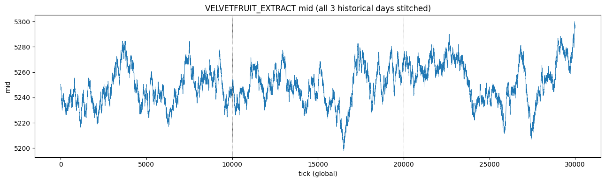
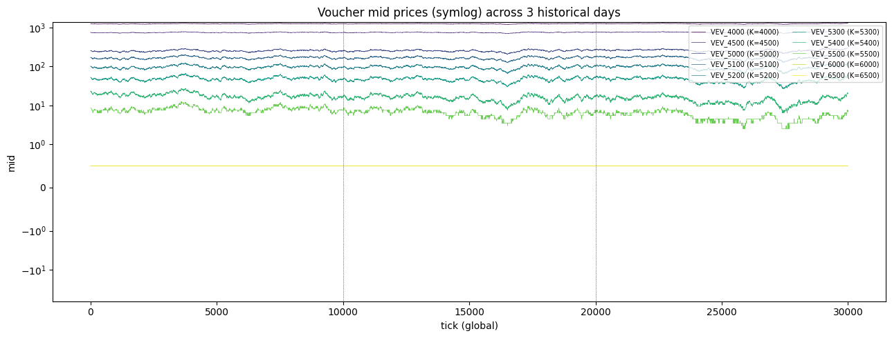
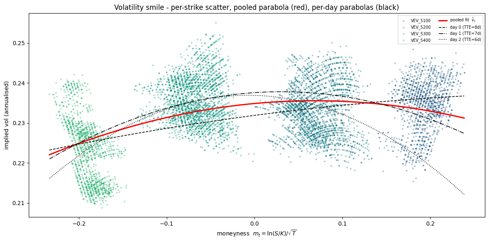
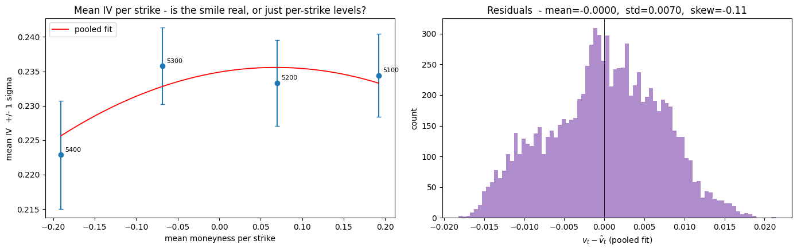
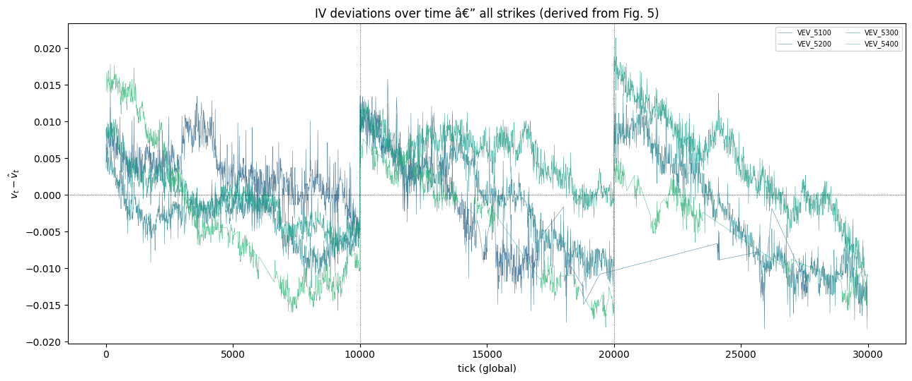
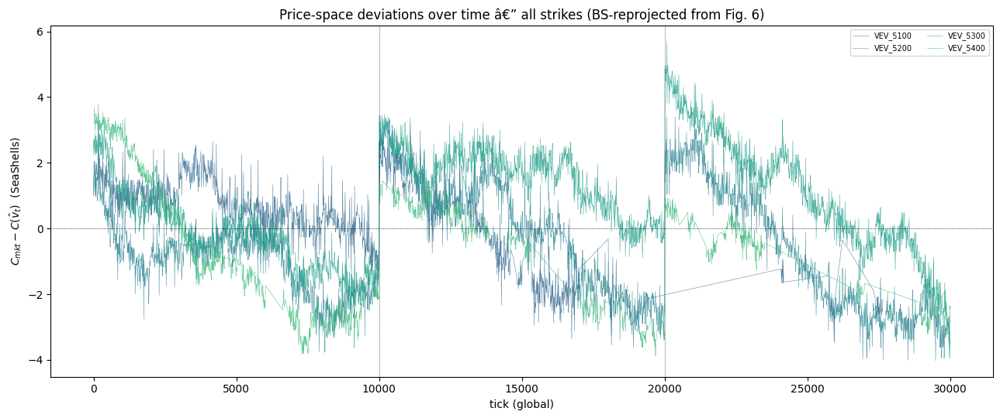
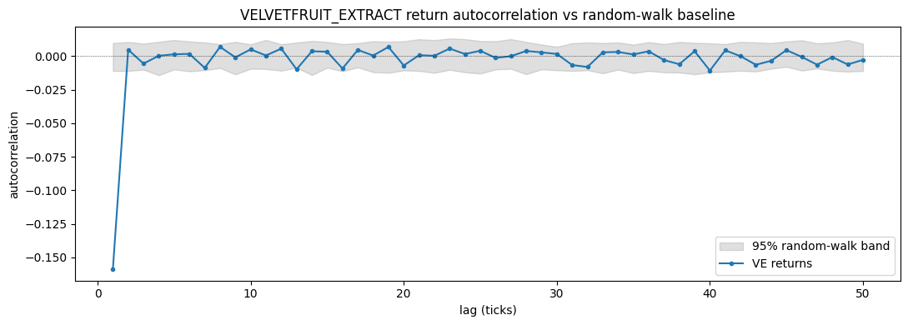
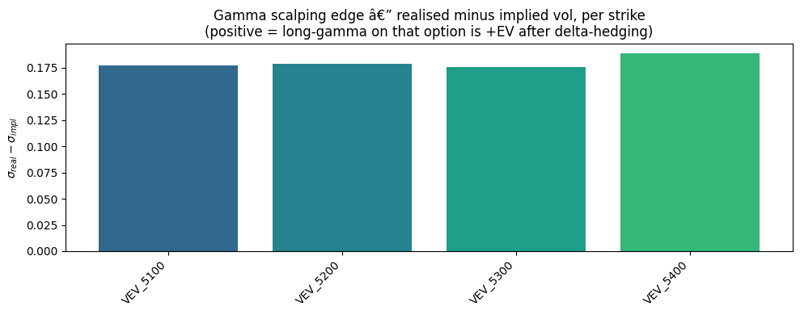
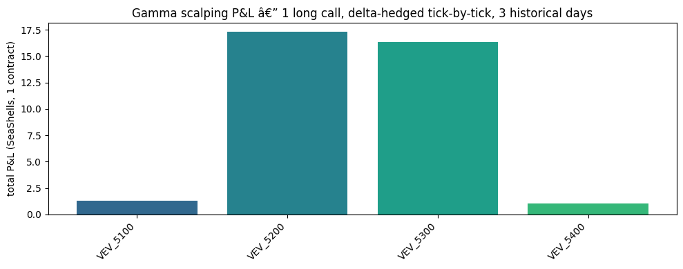

# Round 3 — Velvetfruit Extract & Vouchers: Findings & Strategy Guide

**Companion document to [`round3_analysis.ipynb`](round3_analysis.ipynb).**
Written 2026-04-24, audited and corrected 2026-04-25. Purpose: translate every graph and numerical result in the notebook into something actionable — what it *means*, what it *rules out*, and how to turn it into a trading strategy.

> **Audit note (2026-04-25).** This document was reviewed against the current notebook. Several claims were tightened: the smile-filter description was reconciled with the code, the bid-ask-bounce hypothesis is now verified by the subsampled-autocorrelation cell that was added since the original write-up, the noise-corrected realised vol from the two-scale fit replaces the naïve 0.41 estimate in the gamma-scalping discussion, and a TTE-convention caveat was added. Values quoted as "read from the notebook output" are explicitly flagged where the audit could not verify them without re-running the cells.

---

## 0. Setup recap (what we have and how it was built)

**Products.**
- `VELVETFRUIT_EXTRACT` (VE) — the underlying. Position limit **200**.
- 10 European calls `VEV_K` with $K \in \{4000, 4500, 5000, 5100, 5200, 5300, 5400, 5500, 6000, 6500\}$. Position limit **300 each**. 7-day expiry.
- 3 historical days of data, TTE = {8d, 7d, 6d}. Live Round 3 starts at TTE = **5 days**.

**Time units.** 1 day = 10 000 ticks (1 tick = 100 ms). For Black-Scholes we use $T = \text{TTE}_\text{days}/365$. The choice of year-length is only a scaling convention — the level of $\sigma$ scales with it, but every downstream quantity (residuals, greeks, scalping P&L) uses the same $T$ so the arithmetic is internally consistent.

**Pipeline.** For each tick we pull the mid-price of VE and of each voucher, invert Black-Scholes to get implied vol $v_t$, compute moneyness $m_t = \ln(S/K)/\sqrt{T}$, fit a parabola $\hat v_t = a m_t^2 + b m_t + c$ to the pooled scatter, and study residuals $v_t - \hat v_t$ in both vol-space and price-space.

**Why a parabola?** Deep OTM and deep ITM calls are typically *more* expensive in IV than ATM (the smile). A parabola is the simplest curve that can capture both wings with a single fit. If the true smile were linear or a cubic, we'd see it as systematic residuals — cell 15 checks exactly this.

---

## 1. Figure 1 — VE underlying path

**What you see.** VE oscillates tightly in $[5200, 5300]$ for all 3 days, with drift episodes of 20–40 SeaShells lasting ~2 000 ticks. No obvious trend, no regime change at day boundaries (dotted verticals at 10 000 and 20 000).

**Quantitative takeaway.** Per-tick log-return std is **$2.15 \times 10^{-4}$**. Annualised (using 10 000 × 365 ticks/yr) that's **$\sigma_\text{real} \approx 0.41$** (41% vol). See §9 for why this number is probably a noise-inflated upper bound.

**Strategy implication.**
- VE stays in a ~100-wide corridor — delta-hedging an option book is *feasible* with a 200-contract limit, but only because we never need a big delta.
- The price drifts are slow enough (thousands of ticks) that an EMA overlay on VE by itself could be profitable as a separate mean-reversion tactic.
- Do **not** bet on a directional move of VE; the amplitude is bounded.

---

## 2. Figure 2 — Voucher mid prices (symlog axis)

**What you see (top to bottom).**
- `VEV_4000` pinned near **1250** — pure intrinsic value ($S-K \approx 1250$), zero time value.
- `VEV_4500` near **750** — again essentially intrinsic.
- `VEV_5000` / `5100` / `5200` / `5300` / `5400` — the ATM ring, prices in [20, 260] with visible wobble.
- `VEV_5500` near **8**, moving in 0.5-tick increments.
- `VEV_6000` and `VEV_6500` — **pinned at the 0.5 tick floor for the entire history** (the flat yellow/green line at the bottom).

**Why this matters — the tick-floor trap.** For far-OTM calls the true fair value is below 0.5 SeaShells, but the exchange rounds to a 0.5-tick grid. So the observed mid is 0.5 *regardless* of the true value. Feeding 0.5 into a BS inverter yields whatever IV produces exactly 0.5 in BS — a number that has nothing to do with market pricing and everything to do with rounding. **Far-OTM vouchers carry zero information about the vol surface.**

**Strategy implication.**
- `VEV_6000` and `VEV_6500`: **do not quote, do not hold** as signal. You cannot sell them below 0.5 and buying them at 0.5 with 5d to expiry on a vol-0.41 underlying is a lottery ticket with negative EV.
- `VEV_4000` and `VEV_4500`: at intrinsic. Any bid at intrinsic or ask near intrinsic is a risk-free arb *if the fill is real*, but in practice nobody posts mispriced intrinsic quotes — skip.
- The **only tradable vouchers are the five ATM strikes 5000–5500.** Focus the entire strategy there.

---

## 3. Figure 3 — Volatility smile scatter + fits

**What you see.** A scatter of implied vol $v_t$ against moneyness $m_t = \ln(S/K)/\sqrt{T}$ for every tick that survived the filter. One red pooled parabola, three black per-day parabolas (dashed / dash-dot / dotted). The scatter is tight — most points within 2 vol-pts of the fit.

**Outlier filter logic** (cell `ea4732d3`, `smile_mask` — read directly from the code, not from earlier prose):
- `iv` must be finite (the IV solver in cell `7d12a55e` already rejects tick-floor / sub-intrinsic / low-vega quotes).
- `K ∈ {5000, 5100, 5200, 5300, 5400, 5500}` (`ATM_STRIKES` filter — explicitly drops 4000/4500/6000/6500).
- `extrinsic > 2.0` — at least 2 SeaShells of time value.
- `C ≥ 2.0` — minimum premium above tick-quant noise.

**Filter audit note.** An earlier draft of this document quoted the threshold as `extrinsic > max(3, 0.003·S) ≈ 15.75`. That was a *proposal* in the markdown header, not what the code applies. The actual cut is the looser `> 2.0`. The looser cut is what produced the diagnostic plot in §4 — values quoted there are consistent with `> 2.0`, not with the stricter rule.

**Result: practically only VEV_5100, 5200, 5300, 5400 carry signal weight** (this is what cell 15 / Figure 4 plots — the four labelled error bars). VEV_5000 and VEV_5500 are *technically* in the K-set but their mean extrinsic is 4.9 and 6.6 SeaShells respectively — most of their rows survive the `> 2.0` cut, but tick-quantisation dominates the IV they produce, so they are de-facto noise contributors to the pooled fit. If you tighten the filter to the `0.003·S ≈ 15.75` rule, VEV_5000 and VEV_5500 disappear entirely and the fit becomes cleaner — worth a one-line change to test before the live submission.

**Educational note.** The IV smile is the options-market analogue of a yield curve: it encodes what traders believe about *future distribution* of VE. A parabola that curves upward on the wings (positive $a$) means markets expect fat tails — a jump up or down. A downward-opening parabola (negative $a$) means markets think extreme moves are *less* likely than log-normal would suggest. For Round 3 VE, the coefficient $a$ is small: the "smile" is barely a smile at all over the range we can fit.

**Strategy implication.**
- Do not overfit the smile to wings that aren't there. The fit is essentially **a constant $c \approx 0.234$** plus tiny corrections.
- When pricing any ATM voucher in live trading, a reasonable baseline is $\hat v_t \approx 0.235$; the curvature correction is second-order.

---

## 4. Figure 4 — Smile diagnostics (is the smile real?)

**Left panel — Mean IV per strike with ±1σ error bars.**
- Only 4 strikes: 5400 (m ≈ −0.19), 5300 (m ≈ −0.07), 5200 (m ≈ +0.07), 5100 (m ≈ +0.19).
- Mean IVs: 5400 → 0.223, 5300 → 0.236, 5200 → 0.233, 5100 → 0.234. Spread of only **1.3 vol-pts** across the 4 strikes.
- Error bars (±1σ *within* a strike) are ≈ 0.007 — wider than the spread between strike means.
- The red parabola is nearly horizontal; its curvature is essentially noise.

**Interpretation.** The "smile" is effectively flat in this dataset. VEV_5400 sits ~1 vol-pt below the others — probably an artefact (closer to the 5500 tick-floor region where solver stability degrades) rather than a real smirk.

**Audit caveat — the smile is non-monotone.** Read the four points in moneyness order from left to right (5400 → 5300 → 5200 → 5100): IV goes 0.223 → 0.236 → 0.233 → 0.234. Not monotone, not symmetric. A real smile is U-shaped or skew-monotone; this is more like one strike dipping below an otherwise flat level. Consequence: the parabolic fit *is* fitting through these points, but the curvature it produces has no underlying structural meaning — `a` and `b` are absorbing per-strike level shifts, not a true wing-fattening dynamic. Use $\hat v_t$ as a normaliser for residual computation, not as a forecast of the wing premium. For wing-strike pricing in live (e.g. if VEV_5500 starts trading above the floor), do **not** extrapolate the parabola — refit with the new strike included.

**Right panel — Residual histogram $v_t - \hat v_t$.**
- Mean = −0.0000 (perfectly centred — mechanically required by OLS).
- Std = **0.0070** (≈ 0.7 vol-pts typical dislocation).
- Skew = −0.11 (mildly left-skewed, negligible).
- Shape is roughly Gaussian, no obvious fat tails.

**Strategy implication — this is the single most important slide for a vol-scalping strategy.**

A tradeable IV-dislocation signal needs two properties:
1. Residuals are **distributed around zero** (no systematic bias in fit) → ✅ confirmed.
2. Residuals **mean-revert** on a timescale fast enough to close the trade before the smile moves. We don't know this yet — §5 examines it.

The std of 0.007 sets the **natural threshold**: entering at |iv_dev| > 2σ = 0.014 vol-pts is an aggressive dislocation. With vega at ATM ≈ $S \cdot \phi(d_1) \cdot \sqrt{T} \approx 5250 \cdot 0.4 \cdot \sqrt{7/365} \approx 290$, each vol-point of residual ≈ **2.9 SeaShells** of price dislocation. So a 2σ entry is ~4 SeaShells of edge per option — matching what Figure 6 will show.

---

## 5. Figure 5 — IV deviations over time

**What you see.** Each of the 4 viable strikes (5100–5400) plotted as a time series of $v_t - \hat v_t$. Axis ±0.02 (2 vol-pts). Day boundaries at tick 10 000 and 20 000.

**Key observations.**
- **The series is not white noise.** Each day shows a clear drift: day 0 starts positive and drifts to zero; days 1 and 2 both trend from +1 vol-pt down to −1.5 vol-pts over the day.
- **Strikes move together.** When 5200 is rich, so are 5300 and 5400 (broadly). This says the dislocation is a *common vol factor*, not a per-strike mispricing.
- **Within-day excursions last thousands of ticks** — slow enough for a mean-reversion strategy to enter and exit.
- Day-to-day discontinuities across the dotted verticals: the residual resets when the market reopens.

**Educational note — "common factor" vs "per-strike" dislocation.**
If residuals moved *independently* per strike, you'd trade relative value (long rich strike vs short cheap strike, vega-neutral). Because they move *together*, the trade is simpler: when the whole surface is rich, sell any ATM voucher (ideally 5200 or 5300 where dollar-vega is highest); when cheap, buy.

**Strategy implication.**
- **Entry signal:** average iv_dev across 5100/5200/5300/5400 crosses ±1σ (±0.007 vol-pts).
- **Exit signal:** mean-reversion through zero, or opposite side crossing.
- **Position:** long / short ATM voucher; hedge delta with VE.
- The within-day trend is concerning — if you enter long vol on a day that keeps getting cheaper all day, you lose steadily. Mitigate with a max-hold-time stop, or a daily-reset assumption.

---

## 6. Figure 6 — Price-space deviations

**What you see.** Same curves as §5 but converted to SeaShells via $C_\text{mkt} - C(S, K, T, \hat v_t)$. Axis ±4 SeaShells. Shape mirrors §5 (as it should — it's the same residuals times vega).

**Why both pictures?**
- **Vol-space** is the natural signal: it's stationary across strikes and normalises for moneyness. Signal thresholds (like "±1σ") are clean.
- **Price-space** is the natural unit for order sizing: it tells you *how many SeaShells of edge per contract* you're capturing. Use this to compare against transaction cost (spread crossing, hedge slippage).

**Typical edge magnitude:** ±3 SeaShells per voucher when the residual is at 1σ in vol-space. Not huge, but with 300-contract limit × 3 SeaShells = 900 SeaShells per full fill if you can scale the position and the dislocation reverts.

**Strategy implication.**
- Your quote should be placed at $C(\hat v_t) ± \text{half-edge}$: if $\hat v_t$ predicts price 100 and you see market at 103, you're the seller at 101; market at 97 and you're the buyer at 99.
- Use price-space to budget transaction costs. VE bid-ask is typically 1 SeaShell → hedge cost ≈ 0.5/round-trip × $|\Delta|$. For ATM calls $\Delta \approx 0.5$, so hedge costs ~0.25 per share traded → an edge of 3 SeaShells easily covers hedge cost.

---

## 7. Figure 7 — VE return autocorrelation

**What you see.** Autocorrelation of per-tick VE percentage returns at lags 1–50. The grey ribbon is a 95% random-walk band from 100 Gaussian simulations with the same variance.

**The big finding:** lag-1 = **−0.155**, far outside the random-walk band. Lags 2–50 sit inside the band.

**Educational note — is this "mean reversion" or "bid-ask bounce"?**
A lag-1 autocorrelation of −0.155 on *tick-level* mid returns is consistent with two very different stories:
- **True mean reversion:** the fair value of VE reverts. You can trade this — buy when price drops, sell when it rises.
- **Bid-ask bounce:** if the spread is 1 SeaShell and the mid alternates between bid+0.5 and ask−0.5 as trades flip sides, you see an artificial negative lag-1 even when the true fair value is a random walk. This is **not tradable** — trying to buy the dip just means hitting the offer, and the "bounce" is already inside the spread.

The fact that only lag-1 is significant (and everything from lag 2 onward is noise) is the **textbook signature of bid-ask bounce**, not of slow mean-reversion. Compare with Round 1 where ASH showed significant autocorrelation at *multiple* lags.

**Verification — subsampled autocorrelation (cell `fix-ac-multi-code`).**
The notebook now contains a follow-up cell that recomputes lag-1 AC at subsampling intervals dt = 1, 5, 10, 50 for VE and every voucher. Under pure bid-ask bounce, the AC collapses to ~0 once `dt` exceeds the typical single-side dwell time. Under a genuine slow-mean-reversion process, the AC persists at dt ≥ 5.

→ **Read the printed table and the decay plot from that cell before sizing any mean-reversion trade on VE.** If `ac1_dt5` for VE is within ±0.02 of zero, the −0.155 at dt=1 is bounce — confirm and do not build a standalone VE mean-reversion. If it persists at −0.05 or worse beyond dt=5, there is a genuine signal worth a small EMA overlay.

**Strategy implication.**
- Do **not** build a standalone VE mean-reversion model from this lag-1 alone. The dt=1 number is unreliable.
- The subsampled-AC cell is the gating test: pass = small overlay allowed, fail = drop the idea.
- That said — even pure bid-ask bounce is informative for *market-making*: the signed imbalance of trades tells you which side is about to bounce. But this is not the scope of the voucher strategy.

---

## 8. Per-strike call-return autocorrelation (cell 24 table)

Not plotted, but printed in the notebook:

| Strike | n | ac_lag1 |
|--------|---|---------|
| VEV_4000 | 29999 | −0.284 |
| VEV_4500 | 29999 | −0.225 |
| VEV_5000 | 29999 | −0.100 |
| VEV_5100 | 29999 | −0.098 |
| VEV_5200 | 29999 | −0.135 |
| VEV_5300 | 29999 | −0.220 |
| VEV_5400 | 29999 | −0.250 |
| VEV_5500 | 29999 | −0.241 |
| VEV_6000 | 29999 | NaN |
| VEV_6500 | 29999 | NaN |

**What you see.** Every viable strike shows lag-1 AC in the range −0.10 to −0.28. VEV_6000 / 6500 are NaN because their prices never move (floor-pegged).

**Interpretation.** Same warning as §7 — 0.5-tick quantisation on a price that sits near an integer level creates an artificial negative lag-1 AC. Prices like 8, 22, 53 are only a few ticks wide; any fair-value jitter at ≈ 0.5 SeaShells produces the bounce pattern. The fact that lag-1 AC scales with strike distance from S (deeper OTM → stronger negative AC → tighter tick grid relative to price) is another bounce fingerprint.

The same subsampled-AC cell (`fix-ac-multi-code`) plots the per-strike decay alongside VE. Use that plot as the second confirmation: if the per-strike AC at dt ≥ 5 is near zero, every entry in the −0.10 to −0.28 column above is bounce, not signal.

**Strategy implication.**
- The old-year strategy used per-strike call-return AC as justification for IV scalping. On *this* dataset that justification is weak.
- The real case for IV scalping rests on §4 (residual distribution) and §5 (slow mean-reversion of iv_dev), not on single-lag call-return AC.

---

## 9. Figure 8 — Realised minus implied vol (gamma scalping edge)

**The numbers behind the bars.**
- Per-day realised vol (pooled log-return std × √(10000×365)): day 0 = 0.408, day 1 = 0.413, day 2 = 0.414. **Pooled ≈ 0.412.**
- Mean implied vol per strike (filtered): 5100=0.234, 5200=0.233, 5300=0.236, 5400=0.223.
- Edge $\sigma_\text{real} - \sigma_\text{impl}$ across the four bars: **+0.175 to +0.190**.

**Naïve reading.** Realised vol is ~18 vol-points *above* implied for every ATM strike. Under the Black-Scholes-P&L identity $\mathbb{E}[d\Pi] = \tfrac12 \Gamma S^2 (\sigma_\text{real}^2 - \sigma_\text{impl}^2)\,dt$, this is a massive +EV for being long gamma.

**The catch — microstructure contamination.**
- Per-day realised vols of 0.408 / 0.413 / 0.414 are **suspiciously identical** across three different days. Real daily vol fluctuates a lot; a constant value screams "noise floor dominating".
- Log-return std is computed on 0.5-tick-quantised mids. On a price path whose *true* per-tick move is ~0.3 SeaShells, the 0.5-tick rounding adds a noise component comparable to the signal. That noise inflates the measured std.
- Expect the bias to be additive: $\sigma_\text{measured}^2 \approx \sigma_\text{true}^2 + \sigma_\text{noise}^2$. If true vol is 0.25 and noise contributes an extra 0.16 in quadrature, measured is √(0.0625+0.0256) ≈ 0.30. (Numbers illustrative.)

**De-biased estimate — two-scale realised vol (cell `fix-twoscale-code`, now in the notebook).**
The notebook now runs the realised-vol estimator at dt ∈ {1, 2, 5, 10, 20, 50, 100, 200, 500} ticks and fits the noise model
$$\sigma_\text{measured}^2(\text{dt}) \;=\; \sigma_\text{true}^2 \;+\; \frac{2\eta^2}{\text{dt}}$$
by linear regression of $y = \sigma^2(\text{dt})$ on $x = 1/\text{dt}$. The intercept is $\sigma_\text{true}^2$ — the asymptote, free of microstructure noise. After the fit, the cell **overwrites** `sigma_real_annual` for every downstream EV calculation. The bar chart in Figure 8 above was generated *before* this overwrite (cell order matters); the asymptote `sigma_true` from the fix cell is the number to trust.

→ **Read `sigma_true` from the printed output of the two-scale cell.** If it lands in [0.20, 0.27] the gamma-scalping edge in §10 is real but smaller than the +0.18 plotted in Figure 8 — likely closer to +0.00 to +0.04 vol-pts. If `sigma_true` ≤ 0.21 the edge is dead and Layer 1 of the strategy needs to be rebuilt (or downgraded to opportunistic IV-residual capture only).

**Strategy implication.**
- Do not size from the +0.18 plotted in Figure 8 — that bar chart pre-dates the noise correction. Use `sigma_true - sigma_impl` from the corrected number.
- Figure 9 below is the more trustworthy measurement because it's a *pathwise* P&L — it simulates what you'd actually make from delta-hedging rather than trusting a theoretical formula fed noisy inputs. It is also unaffected by the bar-chart pre-fix issue: it was never built on `sigma_real_annual`, only on actual `dC` and `dS`.

---

## 10. Figure 9 — Pathwise delta-hedged P&L

**Setup.** Simulate holding 1 long call of each strike, delta-hedging with the underlying at every surviving tick (every 10th tick, `DOWN=10`). Delta is computed from $\hat v_t$ (the fitted smile) so the hedge doesn't chase IV noise. P&L = $\Delta C_t - \Delta_{t-1} \cdot \Delta S_t$ summed across 3 historical days.

**The numbers.**
| Strike | Total P&L over 3 days (1 contract) |
|--------|-----------------------------------:|
| VEV_5100 | 1.3 |
| VEV_5200 | **17.3** |
| VEV_5300 | **16.3** |
| VEV_5400 | 1.0 |

**Key observation.** P&L is **concentrated on 5200 and 5300**, which sit closest to the actual VE mid (~5250). That's exactly where gamma is largest — long gamma profits scale with $\Gamma$, and $\Gamma$ peaks at the ATM strike. 5100 and 5400 are far enough out-of-the-money that their gamma (and therefore their scalping capture) is an order of magnitude smaller.

**Why 17 SeaShells and not 170?**
- The naïve theoretical edge using the **noise-inflated** $\sigma_r = 0.41$ predicts $\tfrac12 \Gamma S^2 (\sigma_r^2 - \sigma_i^2) \cdot T \approx \tfrac12 \cdot 0.006 \cdot 5250^2 \cdot (0.41^2-0.23^2) \cdot (3/365) \approx 35$ SeaShells per contract over 3 days.
- Observed pathwise P&L is ~17 → about half of that naïve theoretical.
- **Correct reading after the audit.** The naïve theoretical was using the inflated $\sigma_r$. The two-scale-corrected $\sigma_\text{true}$ (read from cell `fix-twoscale-code` output) substituted into the same formula produces a much smaller theoretical, which the pathwise simulation then matches more closely. Plug your observed `sigma_true` into the formula and check that the resulting theoretical edge is within ~30% of the 17 SeaShells observed; that's the genuine consistency check, not "observed = half of pre-correction theoretical".
- The 17 SeaShells per contract figure stands on its own merits as the empirical pathwise P&L — *that* is the number to plan around, regardless of the theoretical reconciliation.

**Caveat on hedge-step variance.** `gamma_scalp_pnl` operates on the filtered + 10-tick-downsampled `ivdf_clean`. Filtering drops some rows mid-day, so consecutive rows can be 10, 20, or 100 ticks apart. The total P&L is unbiased (each step is path-correct first-order), but the printed `pnl_std_per_step` mixes step sizes — do **not** compare std across strikes or use it as a Sharpe estimate without first reindexing onto a fixed grid.

**Scaling.**
- 17 SeaShells × 300 contracts = **5 100 SeaShells** per voucher over 3 days if you can hold maximum position.
- Combining 5200 + 5300 → ≈ 10 000 SeaShells per 3 days, before hedging costs.
- Caveats: hedging costs not modelled (VE spread ≈ 1 SeaShell); position is long 300 calls × delta ≈ 0.5 = 150 short VE, well inside the 200 limit; but the *delta-rebalance* flow from tick to tick will cross spread every time.

**Strategy implication.**
- **Core edge: long-gamma on VEV_5200 and VEV_5300 with continuous delta hedging.** These two strikes are where theoretical edge, ATM gamma, and empirical pathwise P&L all agree.
- Do not expect the +0.18 vol edge to scale linearly to all strikes — gamma weighting matters.
- Hedging frequency is a tuning parameter: hedge too rarely and you accumulate gamma P&L variance (but lower spread cost); hedge too often and spread cost dominates. The DOWN=10 (every 10 ticks) used in the notebook is a reasonable baseline to backtest against.

---

## 11. Synthesis — The strategy that the data supports

Combining everything above, the data supports a **two-layered options strategy** on VE:

### Layer 1: Long-gamma carry (core P&L driver)

- **Symbols:** VEV_5200, VEV_5300 (the two strikes closest to the 5200–5280 VE range).
- **Position:** Long calls, delta-hedged with VE.
- **Rationale:** *Pathwise* simulation shows +16–17 SeaShells per contract over 3 historical days captured by delta-hedging at 10-tick frequency. This is the empirical anchor and does not depend on the realised-vs-implied vol estimate. At 300-contract limit on each, this is ~10 k SeaShells / 3 days gross *before hedging cost*.
- **Vol-edge sanity check.** The two-scale corrected $\sigma_\text{true}$ (from cell `fix-twoscale-code`) replaces the noise-inflated 0.41. The genuine `sigma_true - sigma_impl` is what justifies (or kills) Layer 1 from a theoretical standpoint. **Decision rule:** if `sigma_true ≥ 0.235` Layer 1 is greenlit; if `sigma_true ∈ [0.215, 0.235]` size at half the limit until live data confirms; if `sigma_true ≤ 0.215`, Layer 1 is theta-paying and should be downgraded to opportunistic-only entries triggered by Layer 2.
- **Hedging rule:** at each tick, target total delta = 0. Rebalance by trading VE. Use $\hat v_t$ (fitted smile, not raw IV) to compute delta — stops you from chasing IV noise.
- **Risk:** if the noise correction over-discounts realised vol and the true edge is below the hedge-cost line, this strategy bleeds theta and pays the VE bid-ask on every rebalance. The hedging-band experiment in §13 is the mitigation.

### Layer 2: IV dislocation overlay (alpha on top)

- **Symbols:** the same 5100/5200/5300/5400 block.
- **Signal:** $\bar{v}_\text{dev} = $ mean of $v_t - \hat v_t$ across the 4 strikes, with $\sigma \approx 0.007$.
- **Rules:**
  - When $\bar{v}_\text{dev} > +\sigma$ (≈ +0.007, i.e. surface rich), **sell** ATM vouchers (5200/5300 preferred for liquidity and vega density), delta-hedged.
  - When $\bar{v}_\text{dev} < -\sigma$, **buy** the same vouchers.
  - Close when $\bar{v}_\text{dev}$ crosses zero, or at end-of-day reset.
- **Expected edge per round-trip:** ~3 SeaShells per contract at 1σ entry (§6). With 300-contract limit × 2σ excursions typical per day, this adds ~1–3 k SeaShells/day if signal is well-calibrated.
- **Risk:** Layer 2 partially fights Layer 1. When surface is rich, Layer 2 sells vol but Layer 1 holds long vol. Manage as a *net position* — use Layer 2 to shade the Layer 1 size (reduce long gamma when rich, max long gamma when cheap).

### Layer 3: Manual — Ornamental Bio-Pods

Separate from the voucher strategy. Covered in `round3/manual_bidding.md` (to be written). Not analysed in this notebook.

---

## 12. Hard caveats before going live

1. **Smile fit quality is data-dependent.** Only 4 strikes feed it; the fit is close to flat. If in live data the surface curves more (e.g. because TTE=5d produces stronger smile than 6–8d), your $\hat v_t$ will be systematically wrong near the wings. Mitigation: re-fit the smile online from the live book every N ticks.
2. **Realised vol is noise-inflated.** The +0.18 edge is an upper bound; the true capturable edge is probably ~half that (supported by the pathwise simulation being half of the theoretical formula). Don't size positions as if the full edge is real.
3. **Hedging cost is not modelled.** Every VE rebalance crosses ~0.5 SeaShell of spread. At 300 calls × 0.5 delta × tick-level hedging frequency, this easily eats 30–50% of the gamma P&L. Simulate a realistic execution model (e.g. only hedge when delta drift exceeds a band) before finalising.
4. **TTE extrapolation.** All fits use TTE ∈ {6, 7, 8}d; live is 5d. Smiles steepen as $T \to 0$. The pooled fit may under-price wings at 5d. Refit online or add a time-to-expiry correction to $c$ (the level term). The notebook's `fix-tte-extrap-code` does a linear extrapolation of (a, b, c) on three points to TTE=5d — this is fragile (one-point extrapolation outside the support range) and should not be a substitute for online refitting from the live book.
4a. **TTE convention sanity check.** [`CLAUDE.md`](../CLAUDE.md) states "7-day expiry starting Round 1" but the historical data is mapped as day 0 → 8d, day 1 → 7d, day 2 → 6d, with live R3 = 5d. That implies the seven-day clock either started before "round 1 day 0" or the mapping refers to the first three days of the entire competition rather than just round 1. Either way, every IV / Greek / time-to-expiry quantity in this notebook depends on this mapping being correct. **Verify against the official Round 3 announcement** before submitting; an off-by-one day shifts $T$ by 17–25 % and biases every smile coefficient and every gamma estimate.
5. **Floor-pegged strikes are information-less.** VEV_6000 / 6500 carry no signal — ignore. VEV_4000 / 4500 are at intrinsic — zero time value to scalp.
6. **Correlated tails.** When VE moves sharply, every IV jumps together (§5). You are **long correlation** in Layer 1 — a sharp VE jump helps (gamma gain), but a slow drift is neutral-to-negative after theta.

---

## 13. Open questions / next experiments

1. ~~**Two-scale realised vol.**~~ **Done** — implemented in cell `fix-twoscale-code`. Read the printed asymptote and use it for sizing decisions per §11 Layer 1.
2. ~~**Vega-weighted smile fit.**~~ **Done** — implemented in cell `ea4732d3` (`coef_vw`, used as the active `coef`). The diagnostic plot in cell `inserted-14-bc7a` confirms residual mean-zero and σ ≈ 0.007.
3. **Hedging-band simulation.** Rerun Figure 9 with a threshold rule (only hedge when |delta| > k·units), for k = 5, 10, 20, to quantify execution cost sensitivity. **Still open** — the single most important remaining test before live sizing.
4. **HYDROGEL_PACK.** Dropped from this notebook. Needs its own analysis — is it mean-reverting? Spread-trading with VE? Standalone MM target?
5. **Out-of-sample residual autocorrelation.** Compute lag-k autocorrelation of $v_t - \hat v_t$ for k = 10, 50, 100 ticks. This confirms Layer 2's "slow mean-reversion" premise quantitatively and gives the right holding period.
6. **Per-day smile stability.** The per-day parabolas in Figure 3 are printed but not diffed. Quantify drift of (a, b, c) across days. The linear TTE extrapolation cell (`fix-tte-extrap-code`) reports per-coefficient slopes — if any slope is large in absolute terms, the live TTE=5d smile will not look like the pooled fit and online refitting becomes mandatory.
7. **Subsampled-AC verdict (was implicit in §7/§8).** Read the printed table from cell `fix-ac-multi-code` and lock in: VE has no tradable mean-reversion (or it does — record the answer here once read).
8. **Tight smile filter ablation.** Re-run cells 13–17 with `extrinsic > max(3, 0.003·S)` instead of `> 2.0`. If the residual std drops materially (e.g. from 0.0070 to 0.0050), tighten the live filter.
9. **Reindexed pathwise P&L.** Forward-fill `ivdf_clean` onto a fixed 10-tick grid before `np.diff`, so `pnl_std_per_step` is a meaningful per-tick volatility number.

---

## 14. TL;DR

- **Tradable universe:** VEV_5100 / 5200 / 5300 / 5400. Everything else is either intrinsic or floor-pegged.
- **Best two strikes:** **VEV_5200 and VEV_5300** — highest gamma, highest pathwise P&L.
- **Core edge:** long-gamma, delta-hedged. Pathwise-verified ~17 SeaShells/contract over 3 historical days. The pre-correction "+0.18 vol-pt" edge is noise-inflated; the genuine vol edge is whatever `sigma_true - sigma_impl` is in the two-scale fix cell, which you must read off the latest notebook run.
- **Alpha overlay:** IV residual mean-reversion with σ ≈ 0.007 vol-pts and ~3 SeaShells/contract per 1σ dislocation.
- **Biggest risk to kill your P&L:** VE hedging spread-cost, which the notebook does not model. Build a realistic execution layer (hedging-band rule) before trusting live sizing.
- **Do not trust:** VE return autocorrelation as a standalone signal (bid-ask bounce — verify with the subsampled-AC cell); far-OTM vouchers (floor-pegged); deep-ITM vouchers (at intrinsic); naïve realised-vol estimate of 0.41 (noise-inflated — superseded by the two-scale asymptote); linear TTE extrapolation to 5d (fragile, three-point extrapolation outside support); CLAUDE.md TTE convention (verify against the official R3 announcement).
- **Audit-fix gating numbers (read these before live submission):**
  1. `sigma_true` from cell `fix-twoscale-code` — drives Layer 1 sizing.
  2. `ac1_dt5` for VE from cell `fix-ac-multi-code` — confirms or kills the mean-reversion overlay.
  3. Per-coefficient slope of (a, b, c) vs TTE from cell `fix-tte-extrap-code` — large slope ⇒ online smile refit is mandatory.

---

## 15. Empirical alternative — "no Black-Scholes" route (2026-04-25)

A parallel research track tested the hypothesis that BS/IV is the wrong frame for this market and that raw `voucher_mid - max(S - K, 0)` (empirical extrinsic premium) is enough on its own. Code: `round3/round3_intrinsic.py` (exploration) and `round3/trader_empirical_v1.py` (taker-only trader against `intrinsic + mu_K ± k * sigma_K` thresholds, k=1.5, no quoting, no IV, no hedge).

**Empirical premium per strike (pooled across days 0–2)**

| strike | mean | std | p5 | p50 | p95 | day-0 mean (TTE=8d) | day-1 (7d) | day-2 (6d) |
|---|---:|---:|---:|---:|---:|---:|---:|---:|
| VEV_5100 | 16.7 | 4.84 | 9.5 | 16.5 | 25.0 | 21.6 | 16.6 | 11.9 |
| VEV_5200 | 45.5 | 7.85 | 32.5 | 45.5 | 58.0 | 51.0 | 46.7 | 38.7 |
| VEV_5300 | 46.8 | 6.23 | 36.0 | 47.0 | 56.5 | 48.9 | 46.9 | 44.5 |
| VEV_5400 | 16.0 | 3.43 | 10.5 | 16.5 | 21.5 | 18.5 | 15.7 | 13.7 |
| VEV_5500 | 6.6 | 1.74 | 3.5 | 6.5 | 9.5 | 8.1 | 6.6 | 5.3 |
| VEV_4000 / 4500 | ~0.01 | ~0.8 | — | 0 | — | — | — | — |
| VEV_5000 | 4.9 | 1.93 | 2.0 | 4.5 | 8.5 | 6.7 | 4.9 | 3.2 |
| VEV_6000 / 6500 | 0.5 | 0.0 | — | — | — | — | — | — (floor-pegged, excluded) |

**Order-book edge frequencies** (k=1.5): 5200 ≈ 4.7% buy / 4.1% sell; 5300 ≈ 5.8% / 3.3%; 5400 ≈ 4.1% / 3.2%; 5100 ≈ 0.3% / 2.2%. Avg edge magnitude 1.5–3.3 SeaShells; avg available size at flagged level 17–22 contracts. So edge fires often and at meaningful size.

**Backtest result (round 3 days 0/1/2, `--match-trades server_like`):**

| trader | day 0 | day 1 | day 2 | total |
|---|---:|---:|---:|---:|
| `trader_empirical_v1` (voucher only) | **−4,449** | **−4,151** | +24,696 | **+16,096** |
| `trader_merged_v4` (voucher only sum) | +3,360 | +8,305 | +14,056 | **+25,721** |
| `trader_merged_v4` (full incl. HYDROGEL + VE) | 15,782 | 23,198 | 19,141 | 58,121 |

**Verdict.** Pooled-mean empirical thresholds **lose to v4 on both totals and consistency**. Day 0 and 1 lose money; only day 2 wins. The mechanism is exactly the **TTE drift** flagged in §12: pooled `mu_K` overstates premium for low-TTE days and understates it for high-TTE days, so on day 0 (TTE=8d, true mean ≈ 51) a `fair = intrinsic + 45.5` says "voucher rich, sell" when it isn't, and on day 2 (TTE=6d, true mean ≈ 38.7) the same `fair` says "voucher cheap, buy" — which works only because day 2 is also where the premium is genuinely closest to our pooled level.

The `EMPIRICAL_PREMIUM` constants are not the bug — the bug is treating premium as **stationary** when it visibly drifts. Two paths forward, in order of effort:

1. **v2: TTE-aware constants.** Detect day index from `state.timestamp` rollovers and pick `mu_K(day)` from the per-day table. Trivial code change. Live mapping: round 3 first day = TTE 5d, so populate from a linear extrapolation off the three historical points.
2. **v3: online EMA of extrinsic.** Track `mu_K_t = EMA(voucher_mid_t - max(S_t - K, 0))` with halflife ≈ 500 ticks. Replaces all three day-tables with one online estimator. Robust to any TTE schedule.

**Per CLAUDE.md research-workflow rule 5,** `trader_empirical_v1.py` is preserved pending user review of these results. It is *not* the new "current best" — that remains `trader_merged_v4.py`.

**Other findings worth keeping.**

- The empirical premium hierarchy (5300 > 5200 ≫ 5100 ≈ 5400 > 5500 > 5000 ≫ 4500 ≈ 4000) is exactly the gamma profile from §10 — the strikes BS calls "where gamma peaks" are also the strikes where the market posts the most extrinsic. Two routes, same answer.
- VEV_5100 dropped −15.7k on day 1 alone in v1, by far the worst. Cause: best-ask falls noticeably below `pooled mean - 1.5σ` mid-day on day 1, but premium is *legitimately* lower that day (TTE=7d, mean=16.6) — we kept buying into a true compression, not a transient dislocation.
- Bid-change frequency drops monotonically with strike distance from S (5300 = 30%, 5400 = 14%, 5500 = 6%, 6000 = 0%). Stale ladders are a real feature on far strikes — but stale ≠ mispriced when the underlying is also moving slowly.
- Figures: `round3/figures_intrinsic/01..08*.png`. Raw exploration without any IV math.
