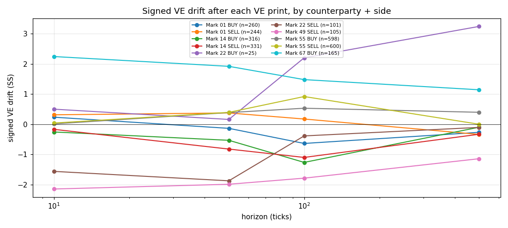
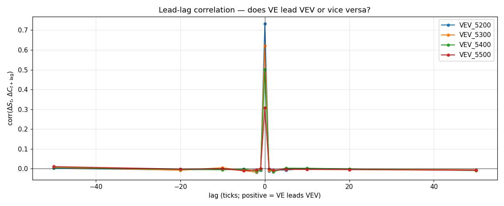
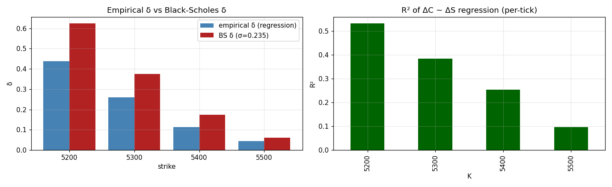
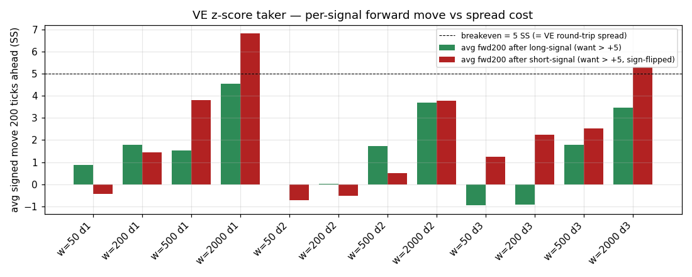

# Round 4 — VE × VEV joint research

**Opened:** 2026-04-27
**Scope:** comparative behaviour of `VELVETFRUIT_EXTRACT` (VE) and the `VEV_*` voucher chain. Where the options notebook ([`round4_options_research.md`](round4_options_research.md)) treats VEV in isolation, this document looks at the **underlying** and the **interaction** between VE flow and VEV flow.
**Reproducible:** all numbers and figures below come from [`research_ve_vev_combined.ipynb`](research_ve_vev_combined.ipynb). PNGs in [`figures_ve_vev/`](figures_ve_vev/) (regenerate with [`_make_figures_ve_vev.py`](_make_figures_ve_vev.py)).

> **Discipline carried in.** Same gates as the hydrogel research and the options research (L1–L7 of [`round4_research.md`](round4_research.md) §0). Backtest is a *gating filter*, not an optimiser. Sub-σ signals stay defensive (sizing only). Discrete thresholds beat sigmoids. Structural alpha survives backtest→live; statistical doesn't.

---

## 0. Why a separate document

The options research already proved:
- Continuous γ-scalp dies on R4 VE spread (=5).
- The smile is flat — no skew arb.
- RV–IV gap = +0.10 vol-pts is real but not extractable via tick-by-tick rebalancing.

That work treated VEV as a self-contained product family, with VE only entering as a hedge cost number. Three questions remain unanswered there, all of which require **looking at VE on its own and at the VE↔VEV interaction**:

1. **Who trades VE?** The CP study covered VEV (Mark 01/14/22/38). VE has a different — and partially disjoint — counterparty set. Some of those CPs do not appear in the options book at all.
2. **Does VEV mid lead/lag VE mid?** The R3 alpha was "VEV mid mean-reverts around BS-implied fair." But is it specifically a delayed reaction to VE moves, or contemporaneous quoting noise?
3. **Are there cross-product CP signals?** When Mark 01 buys VEV, do they hedge in VE? When Mark 22 sells VEV, do they sell VE too?

Answering these unlocks **joint VE+VEV strategy primitives** — specifically the hold-to-expiry vol bet with one-shot VE hedge that the options research flagged as the strongest remaining candidate (§5.1, phase 2).

---

## 1. VE counterparties — a different cast

### 1.1 Who is on the VE tape

3-day pooled VE prints: **1 381** (vs 1 878 VEV prints over the same window). 6 unique CPs on VE; 4 on VEV; 3 CPs are VE-only.

| CP       | VE buys | VE sells | VE qty | VEV buys | VEV sells | VEV qty | net VE | net VEV |
|----------|--------:|---------:|-------:|---------:|----------:|--------:|-------:|--------:|
| Mark 55  |     598 |      600 |  6 551 |        0 |         0 |       0 |     -2 |       0 |
| Mark 14  |     316 |      331 |  3 524 |      315 |       207 |   1 172 |    -15 |    +108 |
| Mark 01  |     260 |      244 |  2 792 |    1 339 |         0 |   4 636 |    +16 |  +1 339 |
| Mark 67  |     165 |        0 |  1 510 |        0 |         0 |       0 |   +165 |       0 |
| Mark 49  |      17 |      105 |  1 186 |        0 |         0 |       0 |    -88 |       0 |
| Mark 22  |      25 |      101 |    843 |        6 |     1 433 |   4 972 |    -76 |  -1 427 |
| Mark 38  |       0 |        0 |      0 |      218 |       238 |     904 |      0 |     -20 |

VE buyer × seller cross-tab — top 5 pairs (% of VE prints):

| buyer   | seller  | n prints | % of tape |
|---------|---------|---------:|----------:|
| Mark 55 | Mark 14 |      331 |   24.0 % |
| Mark 14 | Mark 55 |      316 |   22.9 % |
| Mark 01 | Mark 55 |      260 |   18.8 % |
| Mark 55 | Mark 01 |      244 |   17.7 % |
| Mark 67 | Mark 49 |       89 |    6.4 % |

**Reading.**
- **Mark 55 is the structural VE LP.** 1 198 prints (87 % of the tape), 598 buys / 600 sells — almost flat net inventory. Same role Mark 22 plays for OTM VEV. Critically: **Mark 55 never trades VEV.** It is a VE-only LP.
- **Mark 67 is a VE-only directional buyer** (165 buys, 0 sells), sourcing entirely from Mark 22 (75 prints) and Mark 49 (89 prints).
- **Mark 49** is a VE-only seller (105 sells, 17 buys); the biggest counterparty for Mark 67's buys.
- **Mark 01, 14, 22** appear on both tapes but with very different *roles* on VE. On VEV, Mark 01 is purely directional (1 339 buys / 0 sells). On VE, Mark 01 is **balanced** (260 / 244). Same for Mark 14 (315/207 on VEV, 316/331 on VE). They do not delta-hedge their VEV with VE.
- **Mark 38** trades VEV intrinsic with Mark 14 — never trades VE.

This matters for execution. When we cross VE we are almost always crossing Mark 55. When we make VE we compete with Mark 55 for the inside.

### 1.2 Drift after VE prints — informed/passive labels

Same forward-VE-drift framework as the VEV CP study, applied to VE prints. Sign by side: BUY → +1, SELL → -1. Positive value = CP "won" on the position.

| CP       | side | n    | t+10  | t+50  | t+100 | t+500 | label |
|----------|------|-----:|------:|------:|------:|------:|-------|
| Mark 67  | BUY  |  165 | **+2.24** | **+1.92** | +1.48 | +1.14 | **most informed** |
| Mark 49  | SELL |  105 | -2.14 | -1.99 | -1.78 | -1.14 | passive / picked-off (mirror of 67) |
| Mark 22  | SELL |  101 | -1.56 | -1.87 | -0.39 | -0.10 | picked off short-horizon |
| Mark 22  | BUY  |   25 | +0.50 | +0.16 | +2.20 | +3.24 | small n |
| Mark 55  | BUY  |  598 | +0.01 | +0.39 | +0.53 | +0.40 | LP earning the spread |
| Mark 55  | SELL |  600 | +0.04 | +0.39 | +0.92 | +0.00 | LP earning the spread |
| Mark 14  | BUY  |  316 | -0.26 | -0.53 | -1.26 | -0.10 | picked off |
| Mark 14  | SELL |  331 | -0.17 | -0.82 | -1.10 | -0.33 | picked off |
| Mark 01  | BUY  |  260 | +0.24 | -0.14 | -0.64 | -0.27 | noise |
| Mark 01  | SELL |  244 | +0.31 | +0.38 | +0.17 | -0.34 | noise |

Sign convention: BUY rows use +(s_fut − s_now); SELL rows are sign-flipped so positive = CP "won" the position.

**σ benchmark** (R3-convention): σ_VE per 10 ticks ≈ 2.87 SS, per 50 ≈ 6.41, per 100 ≈ 9.06.

**Interpretation.**
- **Mark 67 BUY is the strongest informed signal anywhere in the round-4 data so far.** +2.24 SS at t+10 = **0.78 σ** on n=165 prints. For comparison, Mark 01's +0.59 SS at t+50 on VEV was 0.09 σ. Mark 67 is genuinely picking the timing on VE. Caveat: n=165 across 3 days is still a thin sample; do not size aggressively against it.
- **Mark 49 SELL is the symmetric loser.** They are the natural counterparty to Mark 67's buys (89 of 105 Mark 49 sells go to Mark 67). Mark 49 prints, then VE drifts up — they get picked off. Same trade-pair, mirror sides.
- **Mark 22 SELL also gets picked off on VE** (-1.56 at t+10): VE drifts up after they sell. Consistent with their VEV LP role — Mark 22 is structurally a passive seller across products.
- **Mark 55 BUY +0.39 / SELL +0.39 at t+50** is the classical LP-earns-the-spread footprint: passive on a mean-reverting path, the LP preferentially fills near local extremes and so "wins" on both sides by drift convention. This is the natural payoff of a tight VE market maker and is not a directional signal we can copy.
- **Mark 14 loses both directions** on VE — confirms its passive / picked-off role across products.
- **Mark 01 is noise on VE** — confirms they do not use VE as a signal-bearing instrument.

**Signal magnitude check (L5 gate).** Only Mark 67 BUY (and its mirror Mark 49 SELL) clears half a σ at any horizon. Everything else is sub-noise on a 3-day window. Even Mark 67 is borderline once you account for sampling variance — n=165. Per L5 the only sustainable use is a **defensive sizing gate**, never a primary signal:

> **Rule:** if the most recent VE print has `buyer == 'Mark 67'` (or `seller == 'Mark 49'`), VE has been observed to drift up afterwards — **pull any passive VE-sell quote we have on that side**, since we'd be selling into Mark 67's flow. This is the "never be the next Mark 49" rule.

This is a *pull-back rule*, not a "follow Mark 67" signal. Same archetype as the VEV CP rule against Mark 22 in the options research.

---

## 2. Lead-lag VE ↔ VEV — does VEV mid lag the underlying?

For each strike K, regress ΔC_K on ΔS at multiple lags. Per-day diffs (avoid spanning rollovers). Positive lag = VE leads VEV.

| K    | lag=-50 | lag=-10 | lag=-2 | **lag=0** | lag=+2 | lag=+10 | lag=+50 |
|------|--------:|--------:|-------:|----------:|-------:|--------:|--------:|
| 5200 |  +0.002 |   0.000 | -0.018 | **+0.731** | -0.007 |  +0.002 |  -0.005 |
| 5300 |  +0.007 |  +0.005 | -0.017 | **+0.621** | -0.010 |  +0.002 |  -0.006 |
| 5400 |  +0.008 |  -0.005 | -0.011 | **+0.502** | -0.015 |  +0.002 |  -0.009 |
| 5500 |  +0.011 |  -0.000 | -0.005 | **+0.308** | -0.007 |  -0.004 |  -0.008 |

**Cleanest result of this whole document.** All lead-lag correlations are < 0.02 in absolute value at every non-zero lag. The contemporaneous correlation (lag=0) carries everything.

Implications:
- **No stale-price arb.** A "VE just moved, VEV hasn't yet" trade does not exist in this data. The option mid updates within the same 100-unit timestamp slot.
- **Per-tick VEV move is dominated by per-tick VE move (for ATM).** R²=0.53 at K=5200, 0.38 at K=5300, 0.25 at K=5400, 0.10 at K=5500. The remaining variance is what mean-reverts in the R3 OTM branch.
- **Far-OTM (5500) has only ~10 % of its tick-to-tick variance explained by VE moves** (R²=0.096). The remaining ~90 % is its own discrete quoting noise — confirms the R3 finding that the OTM-branch alpha lives in mid mean-reversion, not in delta exposure.

### 2.1 Empirical δ vs Black-Scholes δ

Slope of ΔC ~ ΔS, pooled across days, per strike:

| K    | empirical δ | BS δ (σ=0.235) | difference | R²    | n      |
|------|------------:|---------------:|-----------:|------:|-------:|
| 5200 |       0.437 |          0.625 |    **-0.188** | 0.534 | 29 997 |
| 5300 |       0.261 |          0.376 |    **-0.115** | 0.384 | 29 997 |
| 5400 |       0.112 |          0.174 |    -0.061 | 0.253 | 29 997 |
| 5500 |       0.043 |          0.061 |    -0.018 | 0.096 | 29 997 |

**Empirical δ is systematically below BS δ across all four tradeable strikes.** The market's per-tick option-mid response to VE moves is **30 % smaller than Black-Scholes predicts** at the ATM strike, dropping toward parity for far OTM.

**Why this matters.**
- VEV mid is *stickier* than BS predicts. When VE moves up by 1 SS, the 5200 mid moves up by 0.44 SS rather than the BS-predicted 0.62 SS.
- The missing 0.18 SS doesn't vanish — it gets absorbed over the next several ticks as the mid catches up. This *is* the R3 OTM-branch alpha source.
- This pattern is **exactly what the R3 strategy's empirical-δ correction (`d_emp`) was already exploiting** via online estimation. R4 numbers say the correction is still calibrated; no recalibration needed.
- **Anti-pattern:** do not "fix" the basket BS pricing by replacing BS-δ with empirical-δ in a delta-hedge sizing context. The empirical-δ undershoot is *path-realized* drift, not a steady-state delta. If you hedge using empirical-δ × VE, you under-hedge and inherit drift PnL.

---

## 3. Joint counterparty behaviour — does CP flow cross products?

For each CP, count how often a VEV print is followed within 20 ticks by the same CP showing up on the VE tape, and break down the direction.

| CP      | VEV side | VEV prints | VE-print follow-up (20t) | %     | VE buys after | VE sells after |
|---------|----------|-----------:|-------------------------:|------:|--------------:|---------------:|
| Mark 01 | BUY      |     1 339  |                      407 | 30 %  |           212 |            250 |
| Mark 22 | SELL     |     1 433  |                      107 |  7 %  |             3 |        **109** |
| Mark 14 | BUY      |       315  |                      117 | 37 %  |            68 |             78 |
| Mark 14 | SELL     |       207  |                       89 | 43 %  |            44 |             66 |

**Reading.**
- **Mark 01 BUY VEV is NOT a hedge signal.** 30 % follow-up rate, but the directional split on VE is 212 buys / 250 sells — slightly tilted to selling, but balanced enough that you cannot read a hedge from it. Mark 01 trades VE for reasons unrelated to its VEV book.
- **Mark 22 SELL VEV does correlate with SELL VE** (109 sells vs 3 buys, ~36×). When Mark 22 sells a voucher, they tend to sell VE in the same window. **Caveat:** the absolute base rate is tiny (107 / 1 433 = 7 % follow-up). On 93 % of Mark 22's VEV prints there is no VE counterparty action. So while the *conditional* signal is strong, it is rare.
- **Mark 14 splits roughly balanced** on both sides. Not a clean signal.

**Operational reading.** Three concrete conclusions:

1. **No cross-product front-run.** "Mark 01 buys VEV → buy VE" is unsupported by the data. The 462 VE follow-up prints split 212 buy / 250 sell — if anything Mark 01 leans slightly VE-sell after a VEV BUY, but the magnitude is sub-noise (250 vs 212 out of 1 339). Drop this idea entirely.
2. **Mark 22 SELL VEV ↔ Mark 22 SELL VE is a rare-but-clean defensive flag** (109/3 directional split, 7 % base rate). When Mark 22 prints on the VE tape near a VEV-quoting decision, that is exactly the moment to **pull or shrink passive VEV offers on Mark-22-active strikes (5300/5400/5500)** — we don't want to be paired with the systematic-loser side. This adds to the within-VEV "never be the next Mark 22" rule from the options notebook §1.5.
3. **Cross-product CP regression alpha is ruled out.** Within-product CP drift on VEV is sub-noise on a 3-day sample (options notebook §1.4); cross-product flow patterns only tighten conditioning, not magnify magnitude. A weighted "follow Mark 01 across products" model would be v9 in disguise.

**No new directional alpha here. The data confirms (a) independence of Mark 01's two flows and (b) one small extra defensive sizing flag for Mark 22.**

---

## 4. Joint strategy primitives

Three structurally different ways to combine VE and VEV. Greeks at live-start (S=5247.65, T=4d, σ=0.235), edge calibration from the +0.10 RV-IV gap.

### 4.1 Basket A — long-vol with one-shot VE hedge ("hold to expiry")

Long {5200: 100, 5300: 100, 5400: 100, 5500: 50} contracts.

| K    | qty | δ_one  | vega_one | price_one | δ_total | vega_total | premium |
|------|----:|------:|--------:|---------:|--------:|-----------:|--------:|
| 5200 | 100 | 0.65  | 203.65  |    78.58 |   64.92 |   20 365.3 | 7 857.6 |
| 5300 | 100 | 0.35  | 203.01  |    29.74 |   34.78 |   20 301.5 | 2 974.0 |
| 5400 | 100 | 0.12  | 113.00  |     7.92 |   12.49 |   11 299.9 |   791.7 |
| 5500 |  50 | 0.03  |  36.26  |     1.43 |    1.45 |    1 813.0 |    71.3 |

Aggregates:
- **Premium = 11 695 SS** (premium-at-risk at entry).
- **Δ_total = 113.6** → short 114 VE at entry.
- **Vega_total = 53 780**.
- **Edge if RV-IV gap = 0.10:** 5 378 SS gross.
- **One-shot VE hedge cost** at entry: 114 × 5 / 2 = **284 SS** (5 % of expected gross).

Hedge cadence sweep — total VE-spread cost over the 3-day window if we re-hedge whenever portfolio Δ-drift exceeds a band:

| cadence            | rebal | total VE cost | % of 5 378 SS edge |
|--------------------|------:|--------------:|-------------------:|
| one-shot per day   |     3 |         381.6 |              7.1 % |
| band 5  Δ          |   338 |       5 531.1 |          **103 %** |
| band 10 Δ          |   109 |       3 312.0 |             61.6 % |
| band 20 Δ          |    30 |       1 784.7 |             33.2 % |
| band 40 Δ          |     4 |         488.0 |              9.1 % |

**Result.** A wide band (40 Δ, ~4 rebalances over 3 days) leaves 91 % of the gross RV-IV edge intact. Tight rebalancing (band 5, ~340 rebalances) eats the entire gross edge — same disaster as continuous γ-scalp. The right answer is **wide bands or scheduled daily rebalancing**, never threshold-tight rebalancing.

This is the **single concrete joint VE+VEV recipe** worth pursuing into a research backtest. It is structurally distinct from R3 because it requires VE participation (R3 traded VE only as a sub-noise z-score taker, not as a hedge instrument).

### 4.2 Basket B — R3 OTM-branch verbatim, no VE

Already laid out in [`round4_options_research.md`](round4_options_research.md) §5.1 phase 1. No VE involvement; relies on VEV mid mean-reverting around BS-implied fair. The empirical-δ undershoot from §2.1 above is what feeds the R3 alpha.

### 4.3 Basket C — short-vol harvest

Mirror of A: short the basket, long ΣΔ × VE. Same hedging numbers, opposite vega sign. Only worth it if our σ_real estimate is wrong and the market IV (≈ 0.23) is the true number. Given the two-scale fit gives σ_true ≈ 0.33 robustly across all 3 days, this scenario is unlikely. **Do not run unless A loses on the historical backtest, in which case re-examine the σ_true estimate.**

### 4.4 Basket D — VE z-score taker

Forward 200-tick VE move conditional on |z| > 1.5 (rolling-window z-score, mean-reversion expectation):

| day | window | n long sig | avg fwd200 long | n short sig | avg fwd200 short |
|----:|-------:|-----------:|----------------:|------------:|-----------------:|
|   1 |     50 |      1 602 |          +0.88  |       1 655 |          +0.43   |
|   1 |    200 |      1 745 |          +1.78  |       1 684 |          -1.44   |
|   1 |    500 |      1 605 |          +1.53  |       1 560 |          -3.81   |
|   1 |  2 000 |        938 |          +4.53  |       1 325 |          -6.81   |
|   2 |     50 |      1 494 |          -0.01  |       1 446 |          +0.71   |
|   2 |    200 |      1 555 |          +0.02  |       1 458 |          +0.51   |
|   2 |    500 |      1 557 |          +1.72  |       1 547 |          -0.51   |
|   2 |  2 000 |      1 230 |          +3.70  |       1 314 |          -3.77   |
|   3 |     50 |      1 663 |          -0.95  |       1 464 |          -1.24   |
|   3 |    200 |      1 745 |          -0.91  |       1 463 |          -2.23   |
|   3 |    500 |      1 689 |          +1.78  |       1 351 |          -2.51   |
|   3 |  2 000 |      1 542 |          +3.46  |       1 337 |          -5.31   |

Round-trip cost on VE = 2 × 5 / 2 = **5 SS**. Need |fwd200| > 5 to be net-positive on raw signal.

**Most cells are below 5 SS.** Only window=2000 (very long lookback) crosses breakeven, and only intermittently — day 2 long is +3.70 (loses), day 3 long is +3.46 (loses). The one window (=2000) and side (short) where it consistently wins is day 1 / 3 short signals (-6.81, -5.31). This is too inconsistent to deploy.

**Verdict: VE z-score taker is dead on R4.** Same conclusion the options notebook reached for continuous γ-scalp via the VE-spread channel: any strategy that round-trips VE in volume gets eaten by the 5-tick spread. **VE is a hedge instrument, not an alpha instrument, in R4.**

---

## 5. Recommended R4 stack — what changes vs the options-only recommendation

The options research already committed to:
- **Phase 1** = R3 OTM branch verbatim, deep-ITM dropped (no VE involvement).
- **Phase 2** = hold-to-expiry vol bet (mentioned as candidate; basket sizing illustrative).
- **Phase 3** = CP-conditioned sizing on VEV (defensive overlay).

The VE×VEV analysis here **does not change Phase 1**. It **fully specifies Phase 2** as the joint VE+VEV strategy, and adds an additional defensive sizing rule on VE.

### 5.1 Updated phase plan

| Phase | Block | VE involvement | Expected gross edge | Notes |
|-------|-------|----------------|--------------------:|-------|
| 1 | R3 OTM branch on K ∈ {5200, 5300, 5400, 5500} | none | reproduce R3 OTM PnL ~+28 k SS | Empirical-δ undershoot from §2.1 confirms R3 calibration carries |
| 2 | Long basket {5200:100, 5300:100, 5400:100, 5500:50} | one-shot delta hedge at tick 0; rebalance band ≥ 40 Δ | gross +5 378 SS, hedge cost ≤ 500 SS | Single research backtest; do not tune basket weights against the 3-day window |
| 3a | VEV CP-sizing (Mark 01 / Mark 22, within-VEV) | none | defensive | Pull passive VEV offers when last print on the same strike = Mark 01 BUY (= we'd be the next Mark 22) |
| 3b | VE CP-sizing (Mark 67 / Mark 49) | one-shot only | defensive | Pull passive VE-sell quotes if recent VE print = Mark 67 BUY (or Mark 49 SELL — same trade-pair, +2.24 SS at t+10 = 0.78 σ_VE). Strongest CP signal in the round; n=165 keeps it as a sizing gate, not a directional bet |
| 3c | VEV CP-sizing extension (Mark 22 cross-product) | reads VE tape | defensive | When Mark 22 prints SELL on VE, pull/shrink passive VEV offers on Mark-22-active strikes {5300, 5400, 5500}. Rare flag (7 % base rate) but directionally clean (109/3 split). Layered on top of 3a |

### 5.2 What the joint analysis explicitly ruled out

| Anti-pattern | Why |
|--------------|-----|
| VE z-score taker as primary alpha | §4.4 — round-trip cost > forward signal across most windows |
| Continuous Δ-hedged basket A | Hedge cost at band-5 = 5 531 SS = entire gross edge |
| "Follow Mark 01 to buy VE" | §3 — Mark 01 VEV-buy ↔ VE-flow has no clean directional split |
| Empirical-δ as a hedge ratio | §2.1 — emp δ is path-realized drift, not steady-state |
| Cross-strike δ-arb (long stick option, short fluid option × VE) | §2 lead-lag near zero; no stale-price advantage |
| Tuning basket weights against backtest PnL | L7 — 3-day window |

### 5.3 Open questions before any code

1. **TTE init = 4 days.** Same caveat as the options doc: verify by inspecting `state.timestamp` rollovers in the first live ticks. R3 strategy auto-detects via `opt_prev_ts` jumps; live R4 starts at TTE = 4d, decrements once per day-rollover.
2. **Live σ_ATM at TTE ≤ 4d.** No data exists below 5d. If σ_ATM drifts outside [0.10, 0.45] on early live ticks, circuit-break Phase 2 (do not enter the basket) and run Phase 1 only.
3. **Basket sizing is illustrative.** {100, 100, 100, 50} is one balanced choice. Position limits = 300/strike; total premium = 11 695 SS. Final sizing should respect (a) total premium-at-risk budget for the round and (b) desired vega ≪ position-limit-vega. Do not maximise expected PnL on the 3-day backtest.
4. **VE hedge initialisation.** At tick 0 we want to short ΣΔ ≈ 114 VE. The VE book has bid_v1_mean ≈ 11, so a 114-share short cannot be filled in one tick at top of book. Plan to leg into the hedge over 5–10 ticks at market, or quote inside-book passively for the first 200 ticks. The 284 SS hedge-cost figure assumes immediate execution at half-spread; legging in passively trades cost for fill-time risk.

---

## 6. North star — joint VE+VEV

> **The R3 OTM-branch alpha is structurally about VEV mid undershoot per VE move (empirical δ < BS δ at ATM by 0.18 — §2.1). It does not need VE.** The +0.10 RV-IV gap is the only joint-VE-VEV alpha worth pursuing, and only via a **fixed long-vol basket with widely-banded one-shot delta hedge** — not via continuous rebalancing, not via VE-direction signals, not via CP front-running.
>
> VE is a hedge instrument in R4, not an alpha instrument. The 5-tick spread killed VE round-tripping for everyone (us, Mark 14, Mark 22). Mark 55 is the structural VE LP and it earns the spread; we cannot out-make Mark 55 on VE.
>
> One concrete joint recipe (Basket A); two structural confirmations (R3-OTM stays calibrated; smile and lead-lag offer no fresh angle); one small defensive overlay (Mark 67 sizing gate). Anything more is v9 in disguise.
