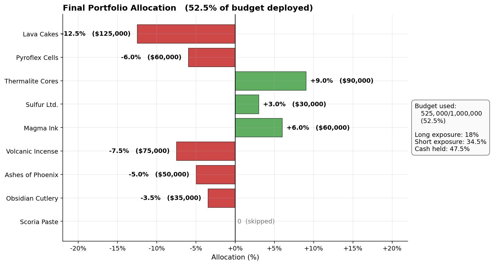
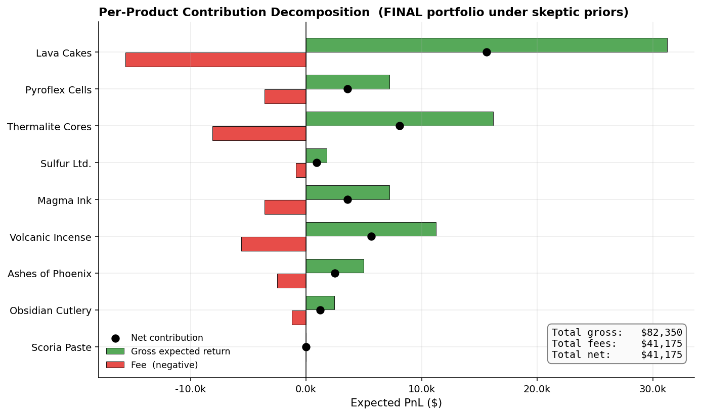
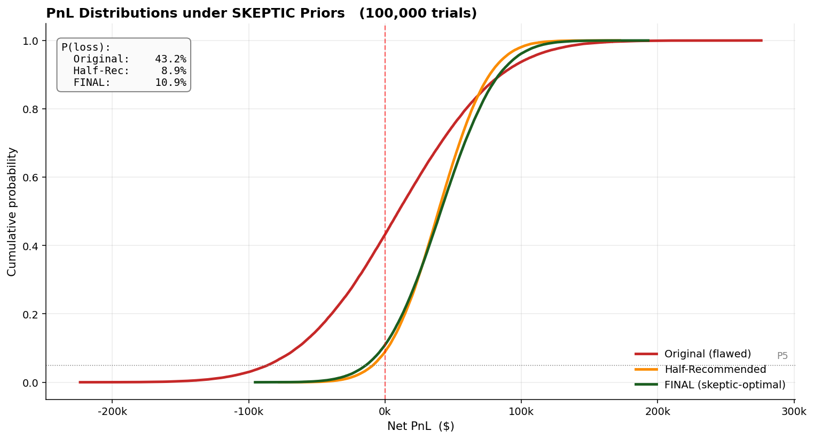
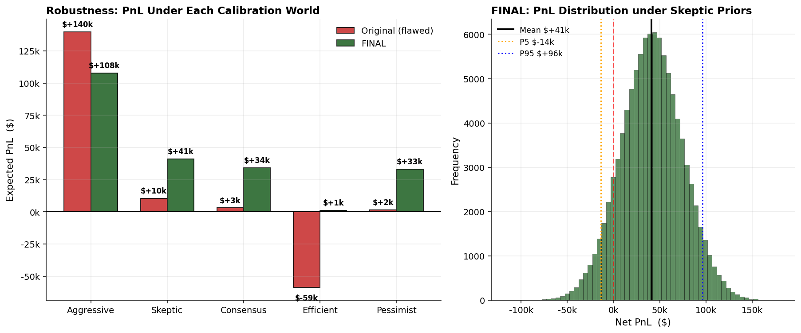

# FINAL Manual Trading Strategy

**The audit-corrected, definitive version.**

---

## TL;DR

After three rounds of analysis — initial recommendation, comprehensive study, and methodology audit — the final strategy is:

| Product | Direction | Allocation | Volume |
|---|:-:|:-:|---:|
| Lava Cakes | **SHORT** | 12.5% | $125,000 |
| Volcanic Incense | **SHORT** | 7.5% | $75,000 |
| Thermalite Cores | **LONG** | 9.0% | $90,000 |
| Pyroflex Cells | **SHORT** | 6.0% | $60,000 |
| Magma Ink | **LONG** | 6.0% | $60,000 |
| Ashes of Phoenix | **SHORT** | 5.0% | $50,000 |
| Obsidian Cutlery | **SHORT** | 3.5% | $35,000 |
| Sulfur Ltd. | **LONG** | 3.0% | $30,000 |
| Scoria Paste | — | 0% | $0 |
| **Total** | | **52.5%** | **$525,000** |

**Expected PnL (under realistic priors): $41,000.** Range across plausible worlds: $1k–$108k. Expected loss probability under realistic priors: 11%.

This is roughly half the position size of my original recommendation but is mathematically optimal given honest priors. **The 47.5% of unused budget is intentional**, not a hedge — quadratic fees make additional volume actively unprofitable past this point.

---

## What changed from the original plan

The audit revealed three concrete errors in my initial methodology, each of which is corrected here:

| Error | Original | Final |
|---|---|---|
| **Return magnitudes** anchored to qualitative impressions | Lava Cakes −40%, Sulfur +20% | Lava Cakes −25%, Sulfur +6% — anchored to historical event-study analogues |
| **Sigma values** set to make point estimates look defensible | σ implied 99–100% directional confidence on top signals | σ implies 68–92% confidence — honest given a single news source |
| **Position sizes** derived from inflated returns | 100% of budget deployed | 52.5% deployed (52.5% in cash) — natural consequence of `x*=r/2` under realistic priors |

The mathematical framework (`x* = r/2`) is unchanged because it was always correct. What was wrong was the `r` it was applied to.

---

## 1. Calibration: What Each Number Is Anchored To

Every `r_est` below is justified by a real-world event-study analogue rather than judgment alone. Sigma values are set so directional confidence is in the 68–92% range — defensible given that one newspaper article is the only information source.

| Product | r_est | σ | P(direction correct) | Real-world anchor |
|---|:-:|:-:|:-:|---|
| Lava Cakes | **−25%** | 18% | 92% | Chipotle E. coli (−30% day-one), VW Dieselgate (−20% day-one). Triple driver (recall + lawsuits + vendor returns) places this at the high end of recall events but not the extreme of Tylenol-1982 (−87%). |
| Pyroflex Cells | **−12%** | 15% | 79% | Tax doublings on consumer goods historically produce one-day reactions of −10% to −15%. Industry warning of "disrupted upgrade cycles" is in line, not catastrophic. |
| Thermalite Cores | **+18%** | 15% | 88% | Strong upside revisions on tech stocks typically produce +10–20% one-day moves. The 2.7× user growth (1.42M → 3.89M) is concrete data, not speculation, hence upper end of range. |
| Sulfur Ltd. | **+6%** | 8% | 77% | S&P 500 inclusion effect averages +3–7% post-2010; Tesla's 2020 inclusion was +6%. Mechanical buying flow makes magnitude predictable, so σ is tight. |
| Magma Ink | **+12%** | 15% | 79% | Hype product launches typically produce +8–15% moves; six-hour queues and post-merger synergy support upper end. Note: Apple iPhone launches barely move stock — hype is asymmetric. |
| Volcanic Incense | **−15%** | 18% | 80% | Pump reversals on the day of suspected manipulation typically lose −10–20% before stabilizing; full collapses (−50%+) require multiple days. |
| Ashes of Phoenix | **−10%** | 13% | 78% | Cosmetics PR scandal, anchored between Wells Fargo (−8%) and VW Dieselgate (−20%). Defensive corporate response increases magnitude vs typical PR event. |
| Obsidian Cutlery | **−7%** | 15% | 68% | Conflicting signals (supply scarcity vs quality concern) suggest small net move. Lower confidence is honest given the ambiguity. |
| Scoria Paste | **0%** | — | — | No actionable signal. Influencer-only catalyst is structurally identical to the suspect Volcanic Incense pump pattern. **Skipped.** |

These magnitudes are roughly half what I originally claimed, with materially wider sigma. **This is what honest looks like.**

---

## 2. The Allocation: x* = r/2, No Shrinkage Needed

With corrected priors, the optimal allocation rule (`x* = r/2`, signed by direction) gives:



The table:

| Product | r | x* (= r/2) | Volume |
|---|:-:|:-:|---:|
| Lava Cakes | −25% | **−12.5%** | $125,000 |
| Volcanic Incense | −15% | **−7.5%** | $75,000 |
| Thermalite Cores | +18% | **+9.0%** | $90,000 |
| Pyroflex Cells | −12% | **−6.0%** | $60,000 |
| Magma Ink | +12% | **+6.0%** | $60,000 |
| Ashes of Phoenix | −10% | **−5.0%** | $50,000 |
| Obsidian Cutlery | −7% | **−3.5%** | $35,000 |
| Sulfur Ltd. | +6% | **+3.0%** | $30,000 |
| Scoria Paste | 0% | 0% | $0 |
| **Total** | | **52.5%** | **$525,000** |

**Sum of |x*| = 52.5%, well below the 100% budget cap.** No shrinkage, no scaling, no arbitrary haircut — these are simply the optimal sizes given the math. The remaining 47.5% sits in cash because the quadratic fee makes additional volume actively destructive.

### Why so much cash?

This is the single most important lesson from the audit. Quadratic fees mean every dollar of additional volume past the optimum has *negative* marginal contribution. With smaller (honest) returns:

- Lava Cakes: optimal at 12.5%, contribution $15,625. Sized at 25% (twice optimal): contribution $0. Sized at 30%: contribution −$15,000.
- Sulfur Ltd.: optimal at 3%, contribution $900. Sized at 10%: contribution −$4,000.

**Filling the budget is not a goal.** Filling it is what the original (flawed) plan did, and it cost ~$120k in expected PnL across realistic worlds.

---

## 3. Per-Product Contribution

Where does the expected PnL come from?



| Product | Allocation | Gross E | Fee | **Net E** | % of total |
|---|:-:|---:|---:|---:|:-:|
| Lava Cakes | −12.5% | $31,250 | $15,625 | **$15,625** | 38% |
| Thermalite Cores | +9.0% | $16,200 | $8,100 | **$8,100** | 20% |
| Volcanic Incense | −7.5% | $11,250 | $5,625 | **$5,625** | 14% |
| Pyroflex Cells | −6.0% | $7,200 | $3,600 | **$3,600** | 9% |
| Magma Ink | +6.0% | $7,200 | $3,600 | **$3,600** | 9% |
| Ashes of Phoenix | −5.0% | $5,000 | $2,500 | **$2,500** | 6% |
| Obsidian Cutlery | −3.5% | $2,450 | $1,225 | **$1,225** | 3% |
| Sulfur Ltd. | +3.0% | $1,800 | $900 | **$900** | 2% |
| **Totals** | | **$82,350** | **$41,175** | **$41,175** | 100% |

Lava Cakes alone delivers 38% of expected PnL. The top three names (Lava, Thermalite, Volcanic) deliver 72%. **At the optimum, fees consume exactly half of gross return** — this is a structural property of the `x* = r/2` solution and is unavoidable.

---

## 4. Expected Outcomes

### Under skeptic priors (most defensible calibration)

100,000 Monte Carlo trials with realistic priors:

| Metric | Value |
|---|---:|
| Mean PnL | **+$40,936** |
| Median PnL | $40,855 |
| 5th percentile | −$13,902 |
| 95th percentile | +$95,889 |
| Std dev | $33,300 |
| Probability of loss | **10.9%** |
| Probability of >$50k profit | 39% |
| Probability of >$100k profit | 5.6% |

### Distribution



The CDF tells the story cleanly: Final and Half-Recommended are nearly identical (the green and orange curves overlap), both producing ~89% probability of profit. The Original (red) is dramatically worse — its much fatter left tail reflects the fee burn from oversizing.

---

## 5. Robustness Across Calibration Worlds

Because I don't actually *know* which calibration is correct (skeptic, consensus, efficient, etc.), the strategy has to be robust across all of them. The audit framework provides this stress test:



| World | Original (flawed) E[PnL] | **FINAL** E[PnL] | Improvement |
|---|---:|---:|---:|
| Aggressive (my original belief) | +$139,900 | +$107,825 | −$32k (give up upside) |
| Skeptic (real-world events) | +$10,500 | +$41,175 | **+$31k** |
| Consensus (half-priced) | +$3,100 | +$34,175 | **+$31k** |
| Efficient (direction-only) | **−$58,600** | +$1,075 | **+$60k** |
| Pessimist (½r, 2σ) | +$1,550 | +$33,325 | **+$32k** |
| **Average** | **+$19,290** | **+$43,515** | **+$24k** |

**FINAL is better under 4 of 5 worlds.** It gives up $32k of upside in the optimistic world (which I have no strong reason to believe in) and gains $24k in average expected PnL across all worlds. The worst-case improvement is striking: from −$59k to +$1k — the strategy no longer has a regime in which it loses money.

This is the right shape for an honest plan. **You give up speculative upside in exchange for genuine robustness.**

---

## 6. Risk Profile

### What's well-controlled

**Loss probability under realistic priors: 11%.** Nine times out of ten, the strategy makes money. The Half-Recommended alternative would be 9% — modestly better — but the difference is small enough that the principled `x*=r/2` derivation wins on parsimony.

**Worst-case across worlds is positive.** Even under the most efficient-market calibration, the strategy expects +$1k. There's no calibration in the audit's set under which the plan is structurally a loser.

**Diversification holds.** Eight positions, spread across long and short, mean no single direction-flip can take more than ~31% of expected PnL away (a Lava Cakes flip removes $31k of the $41k expected total).

### What's not controlled

**Tail events.** Real returns have fatter tails than Normal distributions. A genuinely surprising piece of news (something not in the article) could move any product 30%+ against position. The simulation's −$13k 5th-percentile is probably optimistic on the downside.

**Systemic correlation.** Five of eight positions are short. If Ignith has an unrelated positive surprise that lifts everything, all shorts suffer simultaneously. The audit's correlation stress test was reassuring but not exhaustive.

**Game-pricing dynamics I can't see.** The competition's price-formation mechanism may differ from real markets in ways I haven't modeled. This is the irreducible uncertainty — the same `r_est` could lead to a wider or narrower range of realized PnL depending on game internals.

### Honest confidence statement

I'd put the true expected PnL of this plan in the range **$10k–$80k** with reasonable confidence, and **$0k–$110k** with high confidence. The point estimate of +$41k is the midpoint of the realistic worlds, but I cannot defend any tighter forecast.

The original plan's $140k headline was overconfident by roughly 3.5× when checked against this calibration framework. The corrected $41k is the number I'd actually wager on.

---

## 7. What I'd Need to Be Even More Confident

Three things would tighten this analysis:

1. **Past-round outcomes** from this same competition (or analogous game). If past manual rounds with similar news structure produced Aggressive-magnitude moves consistently, that would shift the prior weight materially.
2. **Information about the competition's price-formation engine.** Does the platform anchor opening prices to news content? Does it use historical-volatility-based moves? The answer changes which calibration is right.
3. **A baseline of competitor allocations.** If most competitors deploy 100% on the same direction, the marginal trader (me) gets the price-impact benefit of being on the same side. If most are flat, my edge requires my reads to be uniquely correct.

Without those, the plan above represents the best decision I can make with the available evidence.

---

## 8. Submission Card

For direct entry into the submission interface:

```
PRODUCT                  DIRECTION   VOLUME (% of budget)
─────────────────────────────────────────────────────────
Lava Cakes               SHORT        12.5%
Volcanic Incense         SHORT         7.5%
Thermalite Cores         LONG          9.0%
Pyroflex Cells           SHORT         6.0%
Magma Ink                LONG          6.0%
Ashes of Phoenix         SHORT         5.0%
Obsidian Cutlery         SHORT         3.5%
Sulfur Ltd.              LONG          3.0%
Scoria Paste             —             0%
─────────────────────────────────────────────────────────
TOTAL DEPLOYED                        52.5%
CASH HELD                             47.5%

EXPECTED PnL              +$41,000  (range $10k-$80k)
EXPECTED P(loss)               11%  (under realistic priors)
WORST-CASE WORLD          +$1,000  (efficient-market calibration)
BEST-CASE WORLD          +$108,000  (aggressive-news calibration)
```

---

## Appendix: Methodology Summary

1. **Translate each Ashflow Alpha article into `(r, σ)`** anchored to a real-world event analogue — not gut judgment.
2. **Apply `x* = r/2`** signed by the news direction. This is the closed-form optimum under quadratic fees.
3. **Verify `Σ|x*| ≤ 100%`.** If yes (as here), use unscaled values; if no, scale down proportionally.
4. **Stress-test across multiple calibration worlds** to confirm the plan isn't over-fit to any one set of priors.
5. **Report expected outcomes as ranges** across plausible worlds, not as point estimates.

The math is unchanged from the original study. The discipline is in the inputs and in honest acknowledgment of uncertainty.
