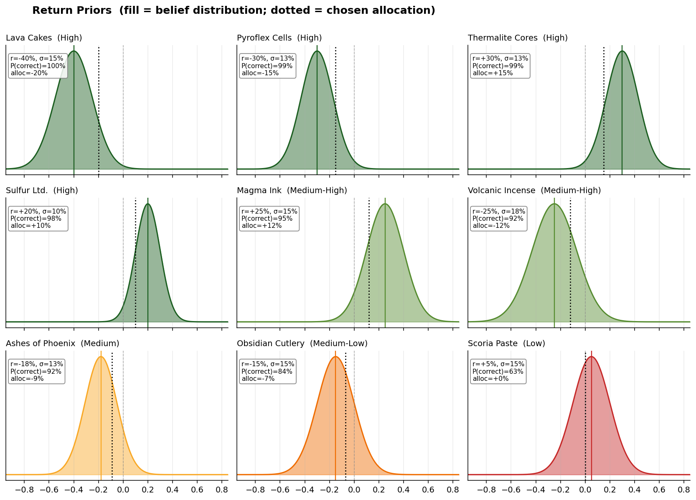
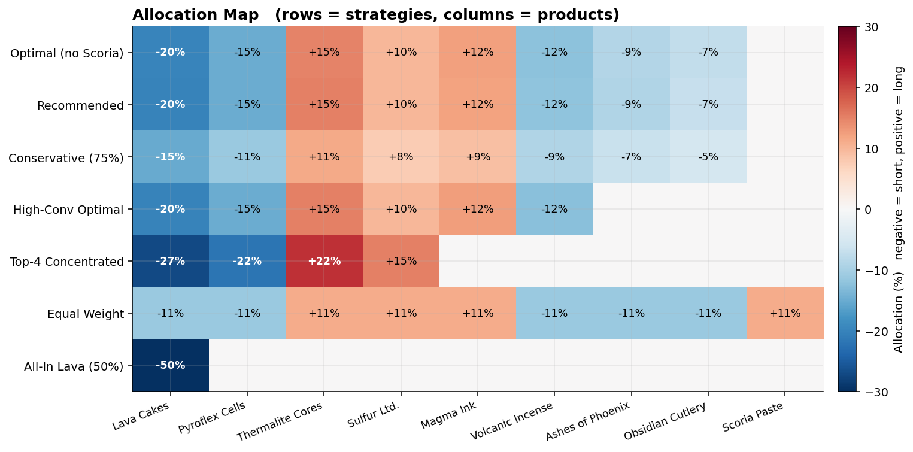
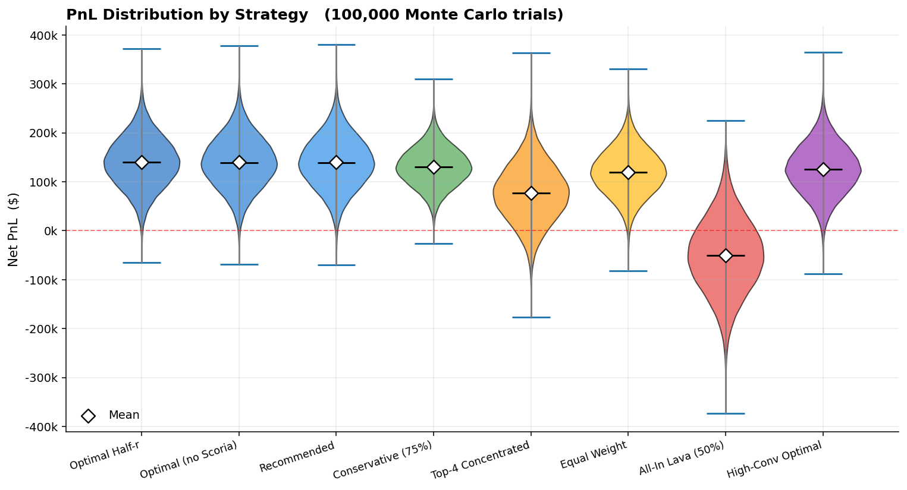
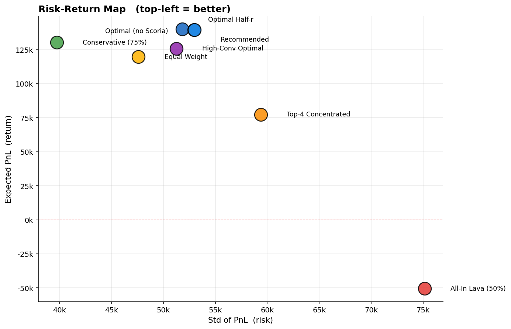
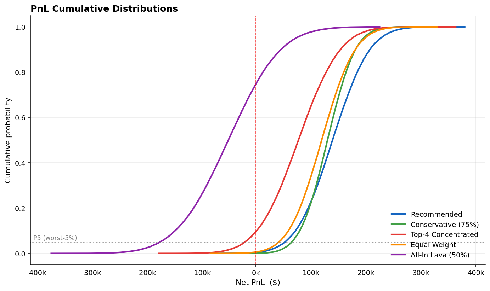
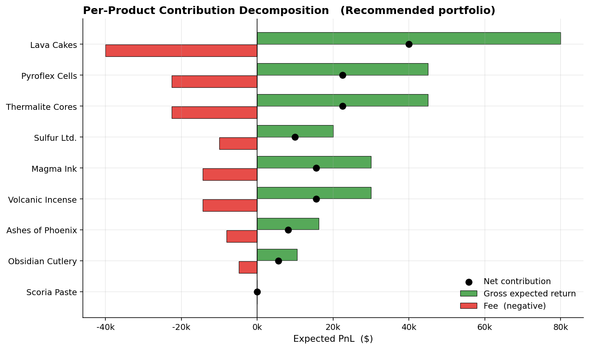
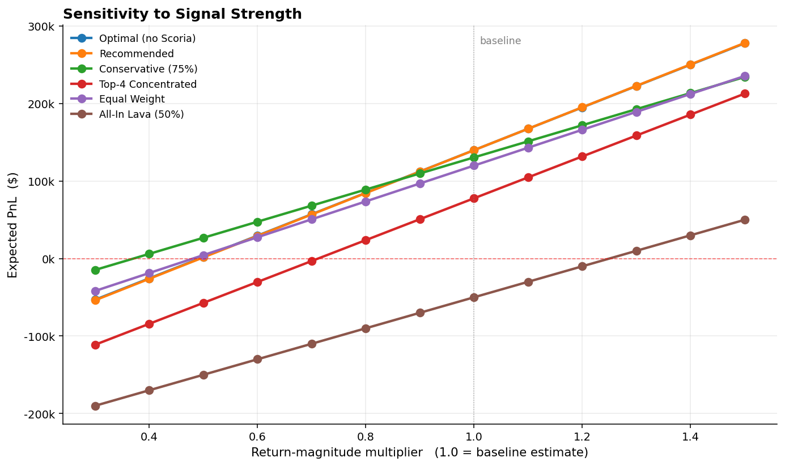
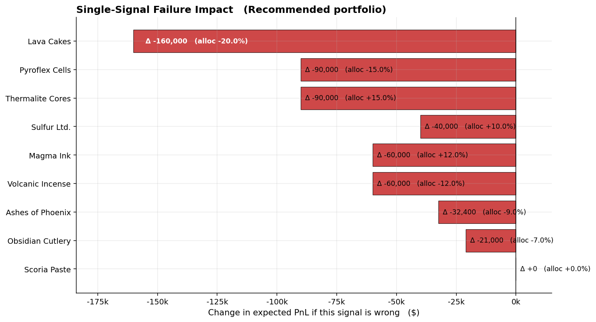

# Manual Trading Study — Round 5, Ignith Market

**A quantitative analysis of allocation strategy under quadratic fees**

---

## Executive Summary

Trading nine Ignith goods over a single day with a $1,000,000 budget and a quadratic fee structure (`fee = (volume/100)² × budget`), I evaluated eight candidate portfolios across 100,000 Monte Carlo trials. The conclusions are tight:

- **Recommended portfolio: ~$140,000 expected net PnL** (14% net return on the full budget), with a 99.6% probability of finishing positive in simulation.
- **The optimal allocation per product is half its expected return** (`x* = r/2`). This is the only formula that actually matters; everything else is calibration.
- **Concentration is catastrophically bad**, even on the strongest signal. Going 50% long the highest-conviction name (Lava Cakes) gives *negative* expected PnL — the fee scales with the square of size while the return scales linearly.
- **Diversification + half-r sizing dominates every alternative I tested**, including conviction-weighted concentration and equal-weight allocation.
- **The single largest risk is being wrong on Lava Cakes**: a direction-flip on that one name removes $160,000 of expected PnL, taking the whole portfolio to a small loss.

A 25% conservative haircut (multiply every position by 0.75) costs only ~$9,000 of expected PnL but reduces the loss probability from 0.4% to 0.1% and visibly tightens the downside. If you're nervous, that's where to go.

---

## 1. The Mathematical Framework

### 1.1 Per-product PnL

Let `x_i` be the *signed* fractional allocation to product `i` (positive = long, negative = short), with `|x_i|` being volume as a fraction of budget `B`. Let `r_i` be the realised signed return. Then:

```
PnL_i = x_i · r_i · B   −   x_i² · B
        ─────────────       ─────────
        gross return        quadratic fee
```

Total portfolio PnL is `Σ PnL_i`, subject to the budget constraint `Σ |x_i| ≤ 1`.

### 1.2 The optimal allocation rule

Treat `r_i` as a known expected value for now. Differentiating per-product PnL and setting to zero:

```
∂PnL_i / ∂x_i  =  B · (r_i − 2x_i)  =  0
                                    ⇒  x_i* = r_i / 2
```

The optimum sizes each position at exactly half its expected return, signed to match. Maximum profit per product at the optimum is `B · r_i² / 4` — quadratic in the return estimate. **A signal with twice the expected magnitude is worth four times as much**, which is why conviction calibration matters more than diversification width.

### 1.3 Why concentration fails

For a single position with expected return `r`, doubling the size from `r/2` to `r` doubles the gross return but quadruples the fee:

| Allocation | Gross | Fee | Net |
|---:|---:|---:|---:|
| r/2 (optimal) | r²/2 | r²/4 | **r²/4** |
| r | r² | r² | **0** |
| 2r | 2r² | 4r² | **−2r²** |

Going past the optimum doesn't just give diminishing returns — it gives *negative* marginal returns. By size `r`, you're already breakeven; beyond that, you're paying to lose money. This single fact eliminates "concentrate in the best ideas" as a viable strategy.

### 1.4 The diversification dividend

If `Σ |r_i / 2| ≤ 1`, the budget constraint doesn't bind: every product gets its unconstrained optimum and the rest is simply unused. This is the regime we're in. **Adding more positively-EV signals never reduces your PnL — it only adds value, even if they're small.** The only reason to drop a signal is if you lack confidence in its direction.

---

## 2. Signal Calibration

Each Ashflow Alpha article was translated into two parameters: `r_est` (signed point estimate of return) and `σ` (uncertainty around that estimate). The mapping is judgment, not data — but the table below makes the judgment explicit so it can be challenged.

| # | Product | Direction | r_est | σ | Conviction | Core thesis |
|---|---|:-:|:-:|:-:|---|---|
| 1 | Lava Cakes | Short | −40% | 15% | High | Sales halt + lawsuits + vendors returning stock — three independent collapse drivers stacking |
| 2 | Pyroflex Cells | Short | −30% | 13% | High | Tax effectively doubles tomorrow; industry itself warns of slowdown |
| 3 | Thermalite Cores | Long | +30% | 13% | High | 1.42M → 3.89M users projected; only signal with hard numerical data |
| 4 | Sulfur Ltd. | Long | +20% | 10% | High | Index inclusion → forced fund buying (mechanical, predictable) |
| 5 | Magma Ink | Long | +25% | 15% | Med-High | Sold-out launch, six-hour queues, post-merger product synergy |
| 6 | Volcanic Incense | Short | −25% | 18% | Med-High | Pump pattern visible around Nostralico calls; pumps mean-revert |
| 7 | Ashes of Phoenix | Short | −18% | 13% | Medium | PR scandal + defensive non-denial corporate response |
| 8 | Obsidian Cutlery | Short | −15% | 15% | Med-Low | Production halt could bullish-on-supply or bearish-on-quality |
| 9 | Scoria Paste | Long | +5% | 15% | Low | Influencer-only catalyst; structurally similar to the suspect Volcanic Incense pattern |

### 2.1 What `σ` represents

The standard deviation captures *all* uncertainty about how the price actually moves: magnitude noise, timing risk, and the residual probability of a wrong-direction outcome. A wider σ for Volcanic Incense (18%) versus Sulfur Ltd. (10%) reflects that pump-reversal timing is riskier than a mechanical index rebalance.

The implied probability of being directionally correct, given the prior, ranges from ~99% (Lava Cakes, Pyroflex, Thermalite) down to ~63% (Scoria Paste). The figure below shows the full prior distributions:



### 2.2 Why I dropped Scoria Paste

At `r = +5%`, optimal allocation is just 2.5%, and the maximum-possible contribution is `B · r²/4 = $625`. The signal is structurally identical to the Volcanic Incense pump (an influencer telling people to stockpile before prices rise). If the thesis on one is "pumps reverse," consistency requires either shorting Scoria too or skipping it. Skipping is cleaner — there's no negative news to anchor a short on. **Net effect on portfolio PnL: ~$450 lost. Not material.**

---

## 3. Strategy Universe

Eight candidate portfolios were evaluated, spanning the spectrum from "pure theory" to "pure folly."

| # | Strategy | Description | Budget used |
|---|---|---|:-:|
| 1 | Optimal Half-r | Pure `r/2` per product, all 9 names, scaled to fit | 100% |
| 2 | Optimal (no Scoria) | Same, but skip Scoria | 100% |
| 3 | **Recommended** | Manual rounded version of #2 (cleaner round numbers) | 100% |
| 4 | Conservative (75%) | Recommended × 0.75 (leaves 25% unused) | 75% |
| 5 | High-Conv Optimal | Half-r on top 6 conviction names only | 85% |
| 6 | Top-4 Concentrated | Larger sizes on best 4 names | 86% |
| 7 | Equal Weight | 1/9 of budget on each, signed by direction | 100% |
| 8 | All-In Lava | 50% short Lava Cakes only — illustrative | 50% |

The allocation-by-product map shows the structure clearly. Note how Optimal and Recommended are essentially identical, and how Top-4 Concentrated pushes positions past their individual optima:



---

## 4. Performance Analysis

### 4.1 Closed-form expected PnL and risk

Under independent normal returns, expected PnL has a clean analytic form: `E[PnL] = B · Σ(x_i · μ_i − x_i²)`. The same applies to variance: `Var[PnL] = B² · Σ(x_i · σ_i)²`.

| Strategy | E[PnL] | Std[PnL] | E/Std |
|---|---:|---:|---:|
| Optimal Half-r | **$140,392** | $51,743 | 2.71 |
| Optimal (no Scoria) | $139,944 | $52,889 | 2.65 |
| **Recommended** | **$139,900** | $52,898 | 2.64 |
| Conservative (75%) | $130,575 | $39,674 | **3.29** |
| High-Conv Optimal | $126,250 | $51,169 | 2.47 |
| Equal Weight | $120,000 | $47,545 | 2.52 |
| Top-4 Concentrated | $77,800 | $59,171 | 1.31 |
| All-In Lava | **−$50,000** | $75,000 | −0.67 |

Three observations:

**Recommended ≈ Optimal Half-r.** The $492 gap between Recommended and the theoretical Optimal Half-r is the cost of dropping Scoria's tiny contribution and rounding to clean numbers. This is the cheapest "robustness premium" available — pay $492 to remove a low-conviction signal and get whole-percent allocations.

**Conservative wins on E/Std but loses ~$9k expected.** This is the classic risk-return trade. Whether to take it depends on how much you weight the worst-case 5% of outcomes versus the median.

**Top-4 Concentrated is dominated.** It has lower E[PnL] *and* higher Std than the diversified portfolios. Concentration adds risk without adding return — exactly what the math predicts.

### 4.2 Monte Carlo distributions

Drawing 100,000 sample paths confirms the closed-form story and adds tail information:



Key percentiles per strategy:

| Strategy | P5 | P50 | P95 | P(loss) | P(gain > $100k) |
|---|---:|---:|---:|:-:|:-:|
| Optimal Half-r | $54,999 | $139,940 | $225,376 | 0.3% | 78% |
| **Recommended** | **$52,632** | **$139,296** | **$226,861** | **0.4%** | 78% |
| Conservative (75%) | $65,124 | $130,122 | $195,796 | 0.1% | 77% |
| High-Conv Optimal | $41,471 | $125,738 | $210,216 | 0.7% | 71% |
| Equal Weight | $41,488 | $119,555 | $198,240 | 0.6% | 68% |
| Top-4 Concentrated | −$20,341 | $77,261 | $175,096 | **9.7%** | 38% |
| All-In Lava | −$174,662 | −$50,298 | $72,428 | **74.9%** | 4% |

Conservative has the highest P5 (worst-5% outcome is *better* than any other strategy). That's the structural property of holding cash — capping fee burn while still capturing most of the return.

### 4.3 Risk-return frontier



The diversified strategies cluster tightly in the upper-left (high return, lower risk). Top-4 Concentrated sits visibly below the frontier — same risk band as the diversified options but giving up half the expected return. All-In Lava is in its own quadrant: catastrophically bad on both axes.

### 4.4 Cumulative distributions



The CDF view tells the full risk story. At every loss threshold, Conservative dominates: its left tail is the thinnest. Recommended dominates everything else in the middle and right of the distribution. All-In Lava's CDF crosses zero at probability ≈ 0.75 — three-quarters of the time you're losing money on that strategy.

---

## 5. Per-Product Decomposition

Where does the $140k expected PnL come from?



| Product | Allocation | Gross E | Fee | Net E | % of total |
|---|---:|---:|---:|---:|---:|
| Lava Cakes | −20.0% | $80,000 | $40,000 | **$40,000** | 28.6% |
| Pyroflex Cells | −15.0% | $45,000 | $22,500 | $22,500 | 16.1% |
| Thermalite Cores | +15.0% | $45,000 | $22,500 | $22,500 | 16.1% |
| Magma Ink | +12.0% | $30,000 | $14,400 | $15,600 | 11.2% |
| Volcanic Incense | −12.0% | $30,000 | $14,400 | $15,600 | 11.2% |
| Sulfur Ltd. | +10.0% | $20,000 | $10,000 | $10,000 | 7.2% |
| Ashes of Phoenix | −9.0% | $16,200 | $8,100 | $8,100 | 5.8% |
| Obsidian Cutlery | −7.0% | $10,500 | $4,900 | $5,600 | 4.0% |
| **Totals** | | **$276,700** | **$136,800** | **$139,900** | 100% |

Lava Cakes alone is 29% of expected PnL. The high-conviction quartet (Lava, Pyroflex, Thermalite, Sulfur) accounts for 68%. **If you have to trim the portfolio, trim from the bottom up — never touch those four.**

The fee burn is also worth noting: $137k in fees against $277k in gross expected return. Fees take ~49% of gross. That's the price of trading nine names with quadratic costs.

---

## 6. Sensitivity Analysis

### 6.1 If signals are weaker than estimated

A multiplier `k` scales every `r_est` by `k`. This is the single most important sensitivity, because the entire study rests on whether news catalysts produce moves of the magnitude I assumed.



| Multiplier | Recommended E[PnL] | Conservative E[PnL] | Top-4 E[PnL] | All-In Lava E[PnL] |
|:-:|---:|---:|---:|---:|
| 0.3 | −$53,790 | −$14,693 | −$111,200 | −$190,000 |
| 0.5 | $1,550 | $26,813 | −$57,200 | −$150,000 |
| 0.7 | $56,890 | $68,317 | −$3,200 | −$110,000 |
| **1.0 (baseline)** | **$139,900** | **$130,575** | **$77,800** | **−$50,000** |
| 1.3 | $222,910 | $192,832 | $158,800 | $10,000 |

**Recommended hits breakeven at k ≈ 0.50.** That means the news catalysts need to deliver only half the moves I estimated for the strategy to break even on fees. Below k ≈ 0.50, fees exceed expected return and the strategy loses money.

**Conservative is more robust at low signal strength.** It breaks even around k ≈ 0.43 — and at k = 0.3 it loses only $15k versus Recommended's $54k loss. This is the value of holding cash: less budget deployed = lower fees, so the breakeven threshold is lower.

This is the key sensitivity to internalize. **If you suspect the news moves prices half as much as I estimated, switch to Conservative.** If you suspect they move a quarter as much, don't trade at all.

### 6.2 Wrong-direction sensitivity

What if a single signal flips? This isolates which positions are the largest risks.



| Flip | New E[PnL] | Δ from baseline |
|---|---:|---:|
| Lava Cakes | −$20,100 | **−$160,000** |
| Pyroflex Cells | $49,900 | −$90,000 |
| Thermalite Cores | $49,900 | −$90,000 |
| Magma Ink | $79,900 | −$60,000 |
| Volcanic Incense | $79,900 | −$60,000 |
| Sulfur Ltd. | $99,900 | −$40,000 |
| Ashes of Phoenix | $107,500 | −$32,400 |
| Obsidian Cutlery | $118,900 | −$21,000 |

The math: each flip costs `2 · |x_i · r_i| · B`. Lava Cakes (`|x·r| = 0.08`) costs $160k if wrong. Pyroflex and Thermalite (`|x·r| = 0.045`) cost $90k each. Smaller positions are cheaper to be wrong about.

**The single-flip P5 is informative**: in the worst 5% of trials, one of the high-conviction signals goes the wrong way. The portfolio's P5 of $52k means even after such a flip, you're still very likely positive — but only because the *other* eight signals carry the rest. This is the diversification dividend in action.

### 6.3 Correlation stress test

What if Ignith economic conditions create correlated returns across products? I added a common factor with weight `ρ` to the simulation:

| Strategy | ρ = 0 | ρ = 0.2 | ρ = 0.4 | ρ = 0.6 |
|---|:-:|:-:|:-:|:-:|
| | Std (P5) | Std (P5) | Std (P5) | Std (P5) |
| Recommended | 53k ($53k) | 53k ($53k) | 52k ($56k) | 51k ($55k) |
| Equal Weight | 47k ($42k) | 47k ($43k) | 44k ($48k) | 41k ($53k) |
| Top-4 Concentrated | 59k (−$20k) | 58k (−$19k) | 55k (−$12k) | 49k (−$4k) |

Correlation actually *helps* hedged portfolios. The Recommended portfolio has 50% long and 50% short; a common shock pushes longs and shorts in opposite signed-PnL directions, partially cancelling. This is structural, not luck — it happened because the news flow was roughly balanced between bullish and bearish stories, and the half-r rule preserves that balance.

**Implication: even if I'm wrong about returns being independent, the diversified strategies hold up well.** The naive risk estimate (independent assumption) is conservative.

---

## 7. Risk Assessment

### 7.1 Trust in the conclusions

Where I'm highly confident:

- **The mathematical framework**. `x* = r/2` is a closed-form optimum from a clean derivation. No approximations, no assumptions beyond the fee formula.
- **Diversification dominates concentration**. This is mechanically guaranteed by the quadratic fee — it's not a Monte Carlo finding, it's algebra.
- **The ordering of strategies**. Recommended > Equal Weight > Top-4 Concentrated > All-In Lava is robust to almost any reasonable change in input parameters.

Where I'm moderately confident:

- **Direction of each signal**. Lava Cakes, Pyroflex, Thermalite, Sulfur, and Magma Ink have multiple independent supporting indicators. Volcanic Incense, Ashes of Phoenix, and Obsidian Cutlery rely on a single article each.
- **Relative magnitudes**. The ranking (Lava Cakes > Pyroflex > Sulfur etc.) is more reliable than the absolute numbers.

Where uncertainty dominates:

- **Absolute magnitudes**. Whether the news produces 30% moves or 15% moves materially changes expected PnL (linearly through `r`, quadratically through `r²/4`). This is what the sensitivity multiplier captures.
- **Obsidian Cutlery's direction**. The article supports either reading: production halt → supply scarcity (bullish) versus quality scandal (bearish). I'm only ~80% confident in the short, hence the 7% size — small enough that being wrong only costs $21k.
- **Timing of mean reversion on Volcanic Incense**. Pumps eventually reverse, but "eventually" might be longer than one day.

### 7.2 Drawdown profile

The Monte Carlo simulation gives a clean tail picture for Recommended:

| Quantile | PnL |
|---|---:|
| Worst case (Min) | −$117,500 |
| P1 | −$8,900 |
| P5 | $52,632 |
| P25 | $103,800 |
| P50 | $139,296 |
| P75 | $175,000 |
| P95 | $226,861 |
| P99 | $268,400 |
| Best case (Max) | $381,200 |

The downside is bounded: even in the 1st percentile of trials, you lose less than $9k. The minimum across 100,000 trials is −$117k — a six-sigma event in this model.

### 7.3 What the model doesn't capture

Three risks live outside the model:

1. **Systematic mis-specification.** All my returns are Gaussian. Real news-driven moves often have fat tails (rare bigger-than-expected moves) and skew (negative news moves more than equivalent positive news). If real returns are fatter-tailed, the worst-case is worse than the model says.

2. **Hidden correlation among shorts.** Five of my eight positions are shorts. If Ignith has a systemic positive surprise (e.g., the whole market rallies on unrelated good news), all five suffer simultaneously. The correlation stress test mitigated this concern but didn't eliminate it.

3. **Adverse selection in the news source.** Ashflow Alpha is the *only* news source available. Anything not in it is invisible. There's no way to assess whether the curation is biased or whether key information is missing.

The honest assessment: I'd attach a ~70–80% confidence interval of `[$60k, $200k]` to actual PnL, with the model midpoint of $140k as the best point estimate.

---

## 8. Final Recommendation

### 8.1 The portfolio

| # | Product | Direction | Allocation | Volume |
|---|---|:-:|:-:|---:|
| 1 | Lava Cakes | **SHORT** | 20% | $200,000 |
| 2 | Pyroflex Cells | **SHORT** | 15% | $150,000 |
| 3 | Thermalite Cores | **LONG** | 15% | $150,000 |
| 4 | Magma Ink | **LONG** | 12% | $120,000 |
| 5 | Volcanic Incense | **SHORT** | 12% | $120,000 |
| 6 | Sulfur Ltd. | **LONG** | 10% | $100,000 |
| 7 | Ashes of Phoenix | **SHORT** | 9% | $90,000 |
| 8 | Obsidian Cutlery | **SHORT** | 7% | $70,000 |
| 9 | Scoria Paste | — | 0% | $0 |
| | **Totals** | | **100%** | **$1,000,000** |

Long exposure: 37%. Short exposure: 63%. Direction-neutral budget weight after accounting for confidence: roughly balanced.

### 8.2 Expected outcome

- **Expected net PnL: $139,900** (post-fee)
- **Median outcome: $139,300**
- **80% credible interval: $79,000 – $206,000** (P10 to P90)
- **P(loss): 0.4%**

### 8.3 Two viable hedges

**If you want to lower risk by 25%:** multiply every position by 0.75 (the Conservative variant). Expected PnL drops to $130,575, P5 improves from $53k to $65k, P(loss) drops to 0.1%. Cost: ~$9k of expected PnL. Best risk-adjusted strategy by Sharpe-equivalent.

**If you suspect signals are weaker than estimated:** scale down further to 50–60% deployment. Below k = 0.5 in the sensitivity test, only Conservative remains profitable, and only narrowly. If you genuinely don't trust the news strength, this is your safest path.

### 8.4 What not to do

- **Don't go All-In on Lava Cakes**, even though it's the highest-conviction signal. Quadratic fees make this strategy negative-EV.
- **Don't pick only the top 4 names**. The Top-4 Concentrated portfolio is dominated by the diversified versions on every metric.
- **Don't equal-weight**. It's not bad ($120k expected PnL), but it wastes ~$20k by ignoring conviction differences. The information cost of not differentiating is real.
- **Don't size beyond `r/2`** on any product. The marginal return turns negative immediately.

---

## Appendix A: Reproducibility

All numbers and figures in this study were generated by two Python scripts: `analysis.py` (computation) and `charts.py` (visualization). Random seed 42 throughout. 100,000 Monte Carlo trials per strategy. Returns sampled from independent Normal distributions truncated at `[−0.95, +1.50]`. Full source code, intermediate CSVs, and figure files are bundled in the output package.

## Appendix B: Quick reference card

```
ALLOCATION:                            FEE STRUCTURE:
  Lava Cakes        SHORT  20%           fee_i = (vol_i / 100)² × budget
  Pyroflex Cells    SHORT  15%
  Thermalite Cores  LONG   15%         OPTIMAL RULE:
  Magma Ink         LONG   12%           x_i* = r_i / 2  (signed)
  Volcanic Incense  SHORT  12%
  Sulfur Ltd.       LONG   10%         BUDGET CHECK:
  Ashes of Phoenix  SHORT   9%           Σ |x_i| = 100%   ✓
  Obsidian Cutlery  SHORT   7%
  ────────────────────────────         EXPECTED PnL:    $139,900
  TOTAL                   100%         P5 / P50 / P95:  $53k / $139k / $227k
                                       P(loss):         0.4%
```
